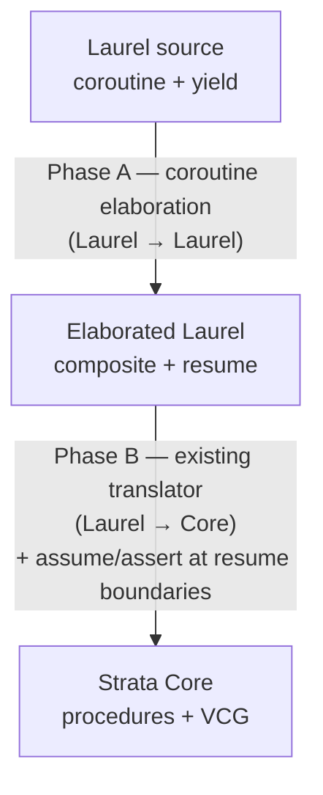

# Yield/Resume Concurrency in Strata

## Status

**Stages 1, 1.5, and Stage 2 are implemented.** Surface (parsing, AST,
resolution, type-namespace registration, pretty-print round-trip) is in
place, and Phase A elaboration now lowers each coroutine into a state
composite + `resume` instance procedure + spawn constructor via a
MoveNext-style state machine, with the caller side rewritten in the
same pass: type annotations `co: <c>` retarget to `co: <c>State`, and
`resume(co[, v])` becomes the instance call `co#resume([v])`.
`rejectCoroutines` is gone — coroutine programs flow through the
pipeline like ordinary code. Stage 3 (Core lowering of the
rely/guarantee VCs and pairwise compatibility) is not yet started. See
[Implementation status](#implementation-status) for details.

Strata models concurrency via coroutines with explicit `yield` and a
per-yield rely/guarantee discipline (`relies` / `guarantees`)
over a shared heap. Plain `requires` / `ensures` keep their usual
construction-precondition / halt-postcondition meaning even on
coroutines. The frontend is Laurel; the lowering target is Strata
Core. No new Core constructs are required — the feature lowers to
existing `assert`/`havoc`/`assume` machinery.

## Programming model

A coroutine procedure is a Laurel procedure whose body may contain `yield`
statements. A `yield` is a *scheduling point*: at a yield, control may
pass to any other coroutine, which may modify shared state before control
returns.

Yield points partition a coroutine body into a sequence of *atomic
segments*:

```
seg₀   yield   seg₁   yield   seg₂   ...
```

Each segment runs sequentially, with no interference. Between two of *my*
segments, the rest of the world may take any number of steps over the
shared heap.

The model is intentionally minimal:

- **Cooperative.** Suspension only happens at an explicit `yield`.
- **Asymmetric.** Each coroutine yields without naming another; the
  scheduler is abstract.
- **Shared-heap.** Coroutines communicate by reading and writing a shared
  composite passed in by reference.
- **Safety only.** No fairness or termination guarantees.

## Surface in Laurel

`coroutine` is a top-level keyword that surfaces to its own `Coroutine`
production in the [grammar](../Strata/Languages/Laurel/Grammar/LaurelGrammar.st).
Stage 2's Phase A elaborates it into a composite plus a `resume`
procedure and a spawn constructor (see
[Lowering pipeline](#lowering-pipeline)).

```
coroutine name(p1: T1, ..., pn: Tn)
  yields (x1: U1, ...)         // optional; outgoing channel bindings
  resumes (y1: V1, ...)         // optional; incoming channel bindings
  requires   <pred>            // construction precondition (at spawn)
  ensures    <pred>            // halt postcondition (at return / falloff)
  relies     <pred>            // per-yield rely (re-assumed each resume)
  guarantees <pred>            // per-yield guarantee (asserted each yield)
  modifies   <heap refs>       // (zero or more)
{ ... body ... }
```

Inside the body:

- `yield` (statement) suspends and drops the resumed value.
- `z := yield` (expression) suspends and binds the value sent in by the
  next `resume(co, v)` (Python `gen.send(v)` semantics).
- `x := e; yield` yields `e` outward by writing to the `yields` binding
  before suspending.
- `return` (bare) is the iterator terminator. `return e` is rejected;
  use `x := e; yield` to send the value out.

At call sites:

- `var co: name := name(args)` spawns a coroutine instance. The coroutine
  name is registered as a type in the namespace.
- `resume(co)` drives the coroutine forward by one segment, dropping the
  yielded value.
- `z := resume(co)` binds the yielded value.
- `resume(co, v)` additionally sends `v` into the coroutine.

Design notes:

- `yields`/`resumes` use the same parenthesized parameter-list shape as
  `returns (r: T)`. Empty parens are rejected — omit the clause if there
  is no value.
- Plain `requires` / `ensures` on a coroutine keep their construction
  / halt meaning. The per-yield rely/guarantee discipline uses the
  dedicated `relies` / `guarantees` keywords; this avoids
  overloading the existing keywords with kind-determined temporal
  semantics. (An earlier design conflated the two via `kind`; reviewer
  feedback motivated the split.)
- Multiple clauses of any kind are conjoined.
- `relies` resolves with the `resumes (y: U)` bindings in
  scope; `guarantees` resolves with the `yields (x: T)` bindings in
  scope.
- `relies` / `guarantees` are coroutine-only: applying them
  to a `procedure` produces a targeted diagnostic.

## Verification rule

A coroutine declares four families of predicates:

- **`requires P`** (construction) — what the caller must establish at
  spawn time, over the parameters and the initial heap. Standard
  procedure-style precondition.
- **`ensures Q`** (halt) — what holds when the coroutine reaches `return`
  or falls off its body. Standard procedure-style postcondition.
- **`relies R`** (rely) — what callers must (re-)establish at
  *every* entry past the first one — i.e. on every `resume(co, v)`.
  Holds across foreign segments. The `resumes (y: U)` binding is in
  scope.
- **`guarantees G`** (guarantee) — what *I* establish across each of
  *my* atomic segments: a relation between segment-start heap and
  segment-end heap, plus the value of the outgoing binding `x` at the
  yield. The `yields (x: T)` binding is in scope.

`R` is required to be reflexive and transitive, so a single application
`R(h_old, h_new, y)` summarizes any number of foreign segments.

`old(e)` inside `relies`/`guarantees` denotes the value of
`e` at the start of the current atomic segment, **not** at procedure
entry. Inside plain `requires`/`ensures` on a coroutine, `old` retains
its standard "value at procedure entry" meaning. This is the only place
`old` is reinterpreted relative to its meaning in ordinary procedures.

### Per-yield obligation

When a coroutine reaches `yield`:

1. `assert G(H_snap, h, x)` — every `guarantees` holds on the heap
   and on the current value of the outgoing binding `x`.
2. `havoc h`; havoc a fresh `v : U` representing the next resumed value.
3. `assume R(H_snap, h, v)` — every `relies` holds, with `y`
   substituted by `v`.
4. The expression-position result of `yield` is `v`. `H_snap := h`.

### Per-resume call obligation

At a call site `resume(co, v)`, the verifier checks that the
single-state part of `relies` on `y` (substituted with `v`) is
satisfied. The heap part is established by the caller's pipeline
reasoning.

This is the same shape as a procedure-call precondition; it fires at
every resume rather than once at entry. (The construction `requires`
fires once, at spawn time; subsequent `resume(co, v)` calls only check
`relies`.)

### Pairwise soundness

For each ordered pair of distinct coroutine instances `(c, c')`, the
verifier checks

```
forall h h' v.  G_c(h, h', x) ==> R_{c'}(h, h', v)
```

— every step `c` may take is permitted by `c'`'s precondition. For a
parameterized coroutine spawned with parameter set `Π`, this collapses to
a single quantified VC over `Π × Π`; `Π` need not be finite or known
up front.

## Lowering pipeline



### Phase A: coroutine elaboration

For each `coroutine c(p₁, …, pₖ) requires R ensures G { body }`, Phase A
(implemented — see [Stage 2](#stage-2--phase-a-elaboration)) generates:

1. A composite `<c>State` with `var $pc: int` (state index; `entry` on
   construction, `END = 0` when done) plus one mutable field per input,
   per body local (the whole suspended frame is hoisted — no liveness
   analysis), and per `yields` binding. `resumes` is *not* a field — it
   is `resume`'s parameter. (`H_snap` is *not* a field; the segment-start
   snapshot is introduced locally by Stage 3, against the heap value
   `HeapParameterization` threads through.)
2. A `procedure <c>State.resume(...)` whose body is a `while (true)`
   dispatch on `self#$pc`: each arm runs one segment, then either
   suspends (`$pc := next; return`) or transitions (`$pc := k`, falls
   through, re-dispatches). Bare `return` sets `$pc := END`. Adjacent
   non-suspending arms are coalesced.
3. A spawn constructor (static procedure named `c`) allocating the
   composite, setting `$pc := entry`, and copying inputs into fields.
4. The clauses move onto the generated procedures: plain `requires` →
   constructor precondition (verbatim); plain `ensures` → `resume`
   postcondition guarded by `$pc == END`; `relies` → `resume`
   precondition (plus `$pc != END`); `guarantees` → `resume`
   postcondition (unguarded). Stage 3 then turns the rely/guarantee pair
   into Core `assert`/`havoc`/`assume` at `resume`'s boundaries:

```
// at entry of C.resume:
assume R(self#H_snap, heap, y);     // scheduler ran some other coroutines
                                    // since I last ran; precondition permits.
... segment dispatch ...
// at exit of C.resume:
assert G(self#H_snap, heap, x);     // I respected my postcondition.
self#H_snap := heap;                // record for next resume.
```

`old(e)` inside R/G desugars to `e[heap := self#H_snap]`. A user-written
`resume(g, v)` becomes a direct call to `C.resume`. Heap parameterization
([HeapParameterization.lean](../Strata/Languages/Laurel/HeapParameterization.lean))
already supplies the heap I/O `resume` needs;
[CallElim](../Strata/Transform/CallElim.lean) handles calls to `resume`
like any other call — no new Core transform.

## Example: an N-process mutex

`N` workers compete for a critical section over a shared composite. We
use a test-and-set spinlock idiom rather than Peterson's algorithm:
Peterson is intrinsically two-process, while spinlock generalizes
cleanly. Atomic test-and-set falls out of the model for free — a segment
between two `yield`s is atomic by construction, so a same-segment
`if (!held) held := true` cannot be raced.

```
composite SpinLock {
  N: int;                          // number of workers (immutable)
  var held: bool;
  var inCS: Map int bool;          // ghost: which workers are in CS
};

// At most one worker is in its critical section.
function mutex(L: SpinLock): bool
  ensures forall i: int =>
          forall j: int =>
            0 <= i & i < L#N & 0 <= j & j < L#N & i != j
            ==> !(L#inCS[i] & L#inCS[j]);

// Coupling: `held` is set iff some worker is in its CS.
function lockedIffCS(L: SpinLock): bool
  ensures L#held <==> exists i: int =>
                        0 <= i & i < L#N & L#inCS[i];

// "My CS-slot was not modified across the foreign segment."
function untouched(L: SpinLock, me: int): bool
  ensures old(L#inCS[me]) == L#inCS[me];

// "Only my CS-slot was modified across my segment."
function onlyMy(L: SpinLock, me: int): bool
  ensures forall j: int =>
            0 <= j & j < L#N & j != me
            ==> old(L#inCS[j]) == L#inCS[j];
```

A single parameterized coroutine handles every worker:

```
coroutine worker(L: SpinLock, me: int)
  requires       0 <= me & me < L#N
  relies     untouched(L, me) & mutex(L) & lockedIffCS(L)
  guarantees onlyMy(L, me)    & mutex(L) & lockedIffCS(L)
{
  var done: bool := false;
  while (!done)
    invariant !done ==> !L#inCS[me]
    invariant mutex(L)
    invariant lockedIffCS(L)
  {
    if (!L#held) {
      // Same segment: test-and-set is atomic.
      L#held := true;
      L#inCS[me] := true;
      yield;
      // ---- critical section ----
      yield;
      // ---- end CS ----
      L#inCS[me] := false;
      L#held := false;
      done := true
    };
    yield
  }
};
```

What the verifier discharges:

1. **Pairwise compatibility** — for `p ≠ p'`,
   `G_worker[me := p] ==> R_worker[me := p']`. The non-trivial conjunct
   is `onlyMy(L, p) ==> untouched(L, p')`: instantiating the inner
   quantifier in `onlyMy` at `j := p'` (legal because `p' ≠ p`) yields
   exactly `old(L#inCS[p']) == L#inCS[p']`. Other conjuncts (`mutex`,
   `lockedIffCS`) are 1-state predicates that match identically.
2. **Per-segment postcondition** — at every `yield`, only the
   `me`-indexed `inCS` slot was written, and `held` was written together
   with `inCS[me]` exactly when entering or leaving CS, preserving
   `lockedIffCS`.
3. **Mutex preservation** — the precondition guarantees `lockedIffCS(L)`
   holds on entry to each segment, so when a worker observes `!L#held`
   it concludes `forall j. !L#inCS[j]`; setting `inCS[me] := true` then
   preserves `mutex`.
4. **Loop invariant** — standard; `mutex` and `lockedIffCS` are carried
   by both precondition and postcondition, so they propagate across
   yields automatically.

Nothing in this proof depends on `L#N`. The same coroutine, the same
contract, and the same four obligations cover every choice of `N ≥ 1`.

A second worked example — a message-passing lock server with a
parametric `ParticipantList`, a non-deterministic scheduler, and the
full rely/guarantee surface (construction `requires`, halt `ensures`,
per-yield `guarantees`) — lives in
[`T23_Coroutines.lean`](../StrataTest/Languages/Laurel/Examples/Fundamentals/T23_Coroutines.lean).
Mutual exclusion as a loop invariant is a tracked follow-up: the
list cell currently carries the coroutine but not its
`ParticipantState`, and Laurel's surface does not yet expose Core's
polymorphic `Sequence` / `m[i]` indexing, so quantifying over
participant states from spec position requires either bundling the
state into the cell or extending the surface.

## Schedulers as ordinary Laurel

After Phase A elaborates a coroutine into a composite with a regular
`resume` procedure, schedulers become ordinary Laurel code:

```
procedure schedule(workers: Set Worker)
  requires forall w: Worker => w in workers ==> w#L == sharedL
{
  while (exists w: Worker => w in workers & w#pc != END)
    invariant mutex(sharedL)
    invariant lockedIffCS(sharedL)
  {
    var pick: Worker := nondetPick(workers);
    assume pick in workers;
    resume(pick)
  }
};
```

The verifier discharges the loop invariant from each `resume` call's
contract; the pairwise compatibility VC is the same single quantified
formula regardless of `|workers|`.

## Implementation status

### Landed

#### Grammar ([LaurelGrammar.st](../Strata/Languages/Laurel/Grammar/LaurelGrammar.st))

- New categories: `CoroutineSpec`, `YieldsClause`, `ResumesClause`,
  `ReliesClause`, `GuaranteesClause`.
- New ops:
  - `yield` (single nullary form). Dual-position: as a statement, drops
    the resumed value; as an expression (`z := yield`), evaluates to
    the value sent in by the next resume.
  - `returnVoid` — bare `return`. Used as the iterator terminator
    inside coroutines.
  - `yieldsClause(parameters: CommaSepBy Parameter)` — `yields (x: T, ...)`,
    mirrors `returns (...)`.
  - `resumesClause(parameters: CommaSepBy Parameter)` — `resumes (y: U, ...)`.
  - `reliesClause` / `guaranteesClause` — the `relies`
    / `guarantees` keywords (dedicated rely / guarantee clauses, no
    keyword overloading).
  - `coroutine` (top-level Coroutine production) and `coroutineCommand`
    (top-level Command wrapper).
- `coroutineSpec(requires, ensures, relies, guarantees, modifies)`.
  Plain `requires` is construction precondition (spawn-time, fires
  once); plain `ensures` is the halt postcondition (return / falloff).
  `relies` / `guarantees` carry the per-yield rely /
  guarantee. `modifies` is the frame.
- `resume(...)` and `old(...)` reuse the generic `call` production; the
  C→A translator rewrites the matching call shapes into dedicated AST
  nodes.

#### AST ([Laurel.lean](../Strata/Languages/Laurel/Laurel.lean))

- New `ProcedureKind = Regular | Coroutine`.
- `Procedure` carries five new fields, all defaulted:
  - `kind : ProcedureKind`,
  - `yields : List Parameter`,
  - `resumes : List Parameter`,
  - `relies : List Condition`,
  - `guarantees : List Condition`.
- Coroutine construction `requires` clauses live in the existing
  `preconditions : List Condition` field; halt `ensures` clauses live
  in `Body.Opaque.postconditions`. The new
  `relies`/`guarantees` fields carry the per-yield rely /
  guarantee predicates.
- `StmtExpr.Yield` is nullary; the resumed value is read via the
  expression position of `yield`.
- `StmtExpr.Resume target value` covers both `resume(g)` and
  `resume(g, v)`.
- `StmtExpr.Return (Option StmtExpr)` already supported `none`; bare
  `return` source now produces it.

#### Translators

- **C→A** ([ConcreteToAbstractTreeTranslator.lean](../Strata/Languages/Laurel/Grammar/ConcreteToAbstractTreeTranslator.lean)):
  arms for `Yield`, `returnVoid`; `q\`Laurel.call` rewrites
  `resume(...)` (1 or 2 args) and `old(e)` (1 arg) to dedicated AST
  nodes. `translateCoroutineSpec` returns the 5-tuple
  `(requires, ensures, relies, guarantees, modifies)`;
  `translateYieldClauses` is the shared helper for the two new clause
  ops. `parseChannelClause` rejects empty parens. `parseCoroutine`
  builds a `Procedure` with `kind := .Coroutine`, populating the new
  `relies`/`guarantees` fields, and an `Opaque` body carrying
  postconditions and modifies. `coroutineCommand` arm in `parseTopLevel`.
- **A→C** ([AbstractToConcreteTreeTranslator.lean](../Strata/Languages/Laurel/Grammar/AbstractToConcreteTreeTranslator.lean)):
  arms for `Yield`, `Resume`, and `Old`; `Resume` and `Old` reuse the
  generic `call` op. `coroutineToOp` / `coroutineCommandOp` printers
  emit the new `relies` / `guarantees` clauses alongside the
  existing `requires`/`ensures`/`modifies`; a kind dispatcher emits the
  right top-level command per procedure. Empty-list channel clauses are
  omitted; empty `coroutineSpec` is omitted entirely. `Return none`
  continues to emit `return { }` (load-bearing for
  `EliminateValueReturns`'s output).

#### Resolution ([Resolution.lean](../Strata/Languages/Laurel/Resolution.lean))

- `resolveProcedure` and `resolveInstanceProcedure` propagate `kind`,
  `yields`, `resumes`, `relies`, `guarantees` (the
  requires/ensures/modifies plumbing is the same as for ordinary
  procedures).
- `yields (x: T)` is in scope inside the body and inside `guarantees`
  / halt `ensures`. `resumes (y: U)` is in scope inside `relies`.
  Stage 1.5 does not enforce strict directional scoping (e.g. preventing
  `y` from leaking into `guarantees`); misuse surfaces as a standard
  unbound-name diagnostic.
- Applying `relies` / `guarantees` to a non-coroutine
  `procedure` produces a targeted diagnostic.
- `resolveStmtExpr` handles `Yield` and `Resume`.
- `return e` in a coroutine is rejected with a diagnostic pointing the
  user to `x := e; yield`.
- Coroutine names register as `.coroutineType` in the type namespace —
  not as `.staticProcedure`. Semantically a coroutine *is* a type;
  Phase A materializes the constructor and `resume` procedure.

#### Type inference ([LaurelTypes.lean](../Strata/Languages/Laurel/LaurelTypes.lean))

`Yield` and `Resume _ _` are tagged `HighType.Unknown`. The honest
types are `T_resume` and `T_yield` respectively, but computing them
requires enclosing-procedure context that the current pure walk does
not have. Real inference is deferred to Stage 2, when elaboration
replaces these nodes with composite-field reads. `Unknown` rather than
`TVoid` avoids silently accepting bad assignments like
`int_var := yield`.

#### Downstream stubs

- [`MapStmtExpr`](../Strata/Languages/Laurel/MapStmtExpr.lean) and
  [`FilterPrelude`](../Strata/Languages/Laurel/FilterPrelude.lean)
  recurse through the new constructors.
- [`LaurelToCoreTranslator`](../Strata/Languages/Laurel/LaurelToCoreTranslator.lean)
  raises *"Stage 2 not implemented"* on `Yield` and `Resume`. After
  Phase A elaboration runs, every `Yield` lives only inside the
  generated dispatch loop (where it is replaced by `$pc := …; return`)
  and every `Resume` is rewritten to an `InstanceCall co#resume(…)`,
  so these arms are unreachable on a correctly-elaborated program —
  they remain as a defensive diagnostic.

#### Pipeline ([LaurelCompilationPipeline.lean](../Strata/Languages/Laurel/LaurelCompilationPipeline.lean))

`CoroutineElaboration` runs before `HeapParameterization` and is the
live path: it rewrites coroutines into composites *and* retargets every
caller (type annotations and `resume(...)` calls). Coroutine programs
flow through the pipeline like ordinary code.

The `LaurelPass` structure gained two flags for this: `needsResolves`
(re-resolve after the pass, so the model reflects newly-generated type
defs) and `skipOnResolutionError` (skip a resolution-dependent pass when
the initial resolution failed). `CoroutineElaboration` sets both.

#### Tests ([T23_Coroutines.lean](../StrataTest/Languages/Laurel/Examples/Fundamentals/T23_Coroutines.lean))

Twelve parse-and-resolve tests, plus an end-to-end lock-server example:

| Test | Coverage |
|---|---|
| `EmptyCoroutine` | bare `coroutine empty() { };` |
| `CounterCoroutine` | `yield` (no value) inside a `while` body |
| `YieldValue` | `yields (x: T)` + `x := e; yield` |
| `AbstractCoroutine` | full `coroutineSpec` (`requires`, `ensures` with `old(...)`, `modifies`) on a bodyless coroutine |
| `SpawnAndResumeStmt` | `var co: producer := producer(args)` + `resume(co)` |
| `ResumeBindsResult` | `z := resume(co)` |
| `ResumeWithSend` | `resume(co, v)` |
| `CoroutineConsumesResumed` | `z := yield` body-side consumption |
| `ReturnWithValueInCoroutine` | negative test: `return e` rejected |
| `BareReturnInCoroutine` | `return` from a nested loop/branch |
| `LockServer` | end-to-end: `Message` datatype, two coroutines (`lockServer` + `participant`), `guarantees` rely/guarantee clauses, recursive `ParticipantList`, non-deterministic scheduler via `<??>` |

### Stage 2 — Phase A elaboration

Implemented in
[`CoroutineElaboration.lean`](../Strata/Languages/Laurel/CoroutineElaboration.lean),
registered as a `LaurelPass` *before* `HeapParameterization`
(`needsResolves := true`, since it adds type definitions, and
`skipOnResolutionError := true`, since malformed input cannot be
elaborated safely).

#### Landed

- **Local collection + promotion.** `collectVarDecl` harvests every body
  local — both bare `var x: T` and the initialized `var x: T := e` form
  (which parses to `Assign`-of-`Declare`) — keyed by resolved `uniqueId`.
  Every local is promoted to a composite field; no liveness analysis (we
  hoist the whole frame, which is simpler and sound — unused fields are
  harmless). `rewriteStmtExpr` rewrites every local read/write to
  `self#field`, preserving reference-site source locations.
- **Collision-only field naming** (`fieldNaming`). Laurel allows
  scope-based shadowing (`var x` in disjoint branches resolve to distinct
  `uniqueId`s), which would collide on the composite's field-name
  resolution key. Names are mangled (`text$uid`) *only* on genuine
  collision, so the common case keeps the user's names for readable
  diagnostics. `resumes` bindings are **not** promoted — the resumed
  value is a per-call argument, lowered to a parameter of `resume`.
- **State-machine linearization** (`linearize`, structural recursion,
  with a termination proof). Compiles the body into `$pc`-dispatched
  state arms: yield-free subtrees stay whole; `yield` suspends
  (`$pc := next; return`); `x := yield` splits into suspend + a resume
  arm that binds the resume parameter into `x` (Python `gen.send`); `if`
  splits with both branches re-converging at the continuation; `while`
  becomes head + bodyEnd with the back-edge through bodyEnd. While
  invariants are asserted at head, body-end, and (implicitly) exit.
- **State coalescing** (`coalesceArms`). A fixpoint peephole pass merges
  yield-to-yield fragments: an arm that tail-transitions (`$pc := k`, no
  `return`) to a single-predecessor, non-entry, non-end arm absorbs that
  arm's body. Suspends are never crossed. Substantially shrinks the
  dispatch table (the bidirectional `adder`: 7 states → 2).
- **`resume` procedure generation** (`populateCoroutineComposite`).
  Instance procedure on the state composite, body = the coalesced
  dispatch loop. Contracts:
  - `relies` → `resume` precondition (per-resume rely),
  - plus `$pc != END` (cannot resume a completed coroutine),
  - `guarantees` → `resume` postcondition (unguarded; holds at every
    yield),
  - plain halt `ensures` → `resume` postcondition guarded by
    `$pc == END` (only fires at completion).
  All clause expressions are rewritten through `fieldNaming` to reference
  `self#…`.
- **Spawn constructor generation** (`coroutineConstructor`). A static
  procedure named after the coroutine: allocates the composite, sets
  `$pc := entry` (the body's first state, *distinct* from the `END = 0`
  "done" state), copies inputs into fields. Carries the source coroutine's
  plain `requires` **verbatim** (its subjects are the inputs, which are
  the constructor's own parameters — no rewrite). `ensures $co#$pc == entry`
  and the input-copy equalities make the first resume's entry provable.
- **Caller-side rewrite** (`rewriteCallerProgram`). Once each coroutine
  `c` is replaced by `<c>State` + a spawn ctor named `c`, every caller
  must be retargeted: type annotations `co: c` retarget to `co: <c>State`
  (recursing into `Applied`/`TSet`/`TMap`/`Pure`/`Intersection` so a
  coroutine inside `Set <c>` is rewritten too); every `resume(co[, v])`
  AST node becomes `InstanceCall co (mkId "resume") [v?]`, the same
  shape `LiftInstanceProcedures` (when present) folds into a top-level
  `<c>State$resume` static call. The rewrite walks every static
  procedure (inputs, outputs, contracts, body, decreases, invokeOn),
  every type definition (composite fields + instance procs,
  constrained-type base/constraint/witness, datatype constructor args,
  alias targets), every static field, and every constant. Local var
  declarations inside bodies, `AsType`/`IsType`/quantifier params, and
  typed holes are all updated in the same pass. `rejectCoroutines` is
  gone; coroutine programs flow through to Core.
- **Tests**
  ([`CoroutineElaborationTest.lean`](../StrataTest/Languages/Laurel/CoroutineElaborationTest.lean)):
  twelve `#guard_msgs` golden cases. Core surface: empty, yield-in-while
  (`counter`), input + `requires` (`producer`), rely/guarantee channel
  (`echo`), bidirectional `x := yield` (`adder`), combined if-inside-while
  (`sieve`). Nested-structure stress cases: nested loops each with a yield
  (`grid`), nested conditionals with an asymmetric yield (`classify`), a
  yield-free inner loop that stays a single coalesced state (`summer`),
  and sequential yields within one branch (`pulse`). Caller-side rewrite
  cases: spawn + drop-style `resume(co)` (pins `co: producerState` and
  `co#resume()`), and `z := resume(co)` / `resume(co, v)` (pins both
  expression-position and statement-position rewrites).

#### Remaining in Stage 2

- **`exit <label>` safety check**: reject `exit` whose target labelled
  block contains a `yield`. Not yet implemented; same-segment exits are
  safe, cross-segment ones are not yet diagnosed.
- **Expression-position yield in non-trivial positions** (e.g.
  `x := f(yield)`): currently kept as a single state rather than lowered;
  should be rejected at resolution.

### Stage 3 plan — Core lowering and VCG

- **Translation rule** in
  [`LaurelToCoreTranslator`](../Strata/Languages/Laurel/LaurelToCoreTranslator.lean):
  for any procedure carrying `relies R` / `guarantees G`
  from `kind = .Coroutine`, emit
  `assume R(self#H_snap, heap, y)` at `resume` entry and
  `assert G(H_snap_cur, heap, x); self#H_snap := heap` at `resume`
  exit. Plain `requires` flows to the constructor; plain `ensures`
  flows to the `pc := END` branch only. (Phase A already places `relies`
  / `guarantees` / END-guarded `ensures` / `requires` on the right
  generated procedures; Stage 3 adds the heap-snapshot threading and the
  `old(e)` rewrite below.) `old(e)` inside `relies` / `guarantees`
  desugars to `e[heap := self#H_snap]` (the segment-start snapshot);
  inside plain `requires` / `ensures` it keeps its standard meaning.
- **Pairwise compatibility VCs**: one Core procedure per ordered pair
  of coroutine *types*, with the quantified
  `forall p p'. p ≠ p' ==> G_C(...) ==> R_D(...)` formula.
- **Recommendation**: desugar at translation time rather than extending
  `Core.Procedure.Spec`. Keep Core unchanged.
- **Tests**: the spinlock from this doc verifies; a deliberately
  unsound contract mismatch fails with a localized diagnostic.

### Remaining TODOs

Smaller items; none block Stage 2.

- **Restrict bare `return` to coroutines.** Resolution permits
  `Return none` everywhere it parses; it should be rejected outside
  coroutines (procedures terminate by falloff, or `return e` for
  single-output). Deferred so we can audit
  [`EliminateValueReturns`](../Strata/Languages/Laurel/EliminateValueReturns.lean)
  before tightening.
- **Scope-restriction errors for `x` and `y`.** Resolution puts the
  channel bindings in scope but does not strictly enforce
  `x ∈ guarantees only` / `y ∈ relies only`. Misuse
  currently surfaces as an unbound-name diagnostic.
- **Argument and resume-target type checking.** Spawn calls
  (`producer(args)`) and the `co#resume(v)` instance call (post Phase A)
  inherit arity and type checks from the existing constructor / instance
  call paths. Worth a follow-up audit to confirm error messages localize
  back to the original `resume(co, v)` source rather than the rewritten
  form.
- **Plumb `T_resume` / `T_yield` into `LaurelTypes`.** Phase A replaces
  every `Resume` with `InstanceCall` and every `Yield` with dispatch-loop
  surgery before type inference runs, so the `Unknown`-tagged arms in
  [`LaurelTypes.lean`](../Strata/Languages/Laurel/LaurelTypes.lean) are
  now defensive — confirm with a regression test and consider tightening.
- **Asymmetric `Return none` round-trip.** Source `return` parses to
  `Return none`, but the A→C printer emits `return { }`; re-parsing
  yields `Return (some <empty block>)`. Fine for current usage; revisit
  if anything depends on round-trip identity.
- **Diagnostics provenance.** Generated `assert`/`assume` should carry
  metadata pointing back to the source `yield` / `coroutine` location,
  so failed obligations land on user code rather than synthesized
  fields. The existing
  [MetaData](../Strata/DL/Imperative/MetaData.lean) plumbing covers
  this.
- **Verso docs.**
  [docs/verso/LaurelDoc.lean](verso/LaurelDoc.lean) gains a
  "Coroutines" section once Stage 2 is in.
- **Spec-side iteration over a participant pool.** Writing a
  cross-participant invariant (e.g. mutex on the lock-server example)
  needs either bundling per-participant state into the recursive list
  cell or extending the surface to expose Core's polymorphic
  `Sequence a` / `m[i]` indexing on `Map K V`. Currently neither is
  available; see the lock-server example for context.

## Future / out of scope

- **`yield from`** — recursive yielding through a sub-coroutine,
  Python-style `yield from`. Stage 2's per-yield CFG construction does
  not handle it.
- **True preemption / shared-memory threads.** The cooperative
  discipline here is a strict subset; a preemptive model needs
  Owicki-Gries-style proof rules.
- **Fairness and liveness.** We verify safety only. Per-coroutine
  termination is the existing `decreases` check; lockout-freedom is
  not addressed.
- **Mixed-type dynamic pools.** Parameterized coroutines cover
  statically *typed* but dynamically *populated* worker pools (one
  quantified VC, any number of instances). Mixing different coroutine
  types whose membership changes at runtime — where the set of ordered
  pairs to check itself depends on program state — is out of scope.
- **Stratified rely/guarantee** (nested coroutines with their own
  contract over sub-state) and **ownership transfer** between
  coroutines are possible extensions but not addressed.
