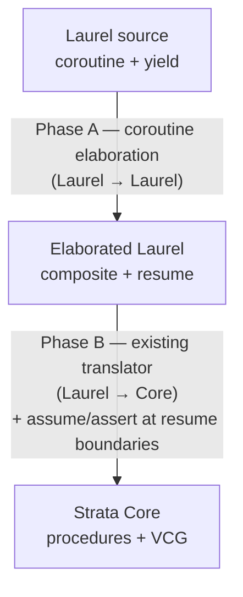

# Yield/Resume Concurrency in Strata

## Status

**Stages 1 and 1.5 are implemented**: surface (parsing, AST, resolution,
type-namespace registration, pretty-print round-trip) is in place. Stage 2
(Phase A elaboration into a composite + `resume` procedure) and Stage 3
(Core lowering and VCG) are not yet implemented. See
[Implementation status](#implementation-status) for what's landed.

Strata models concurrency via coroutines with explicit `yield` and a
per-yield rely/guarantee discipline (`yield_requires` / `yield_ensures`)
over a shared heap. Plain `requires` / `ensures` keep their usual
construction-precondition / halt-postcondition meaning even on
coroutines. The frontend is Laurel; the lowering target is Strata
Core. No new Core constructs are required — the feature lowers to
existing `assert`/`havoc`/`assume` machinery.

## Programming model

A coroutine procedure is a Laurel procedure whose body may contain `yield`
statements. A `yield` is a *scheduling point*: at a yield, control may
pass to any other coroutine, which may modify shared state before control
returns.

Yield points partition a coroutine body into a sequence of *atomic
segments*:

```
seg₀   yield   seg₁   yield   seg₂   ...
```

Each segment runs sequentially, with no interference. Between two of *my*
segments, the rest of the world may take any number of steps over the
shared heap.

The model is intentionally minimal:

- **Cooperative.** Suspension only happens at an explicit `yield`.
- **Asymmetric.** Each coroutine yields without naming another; the
  scheduler is abstract.
- **Shared-heap.** Coroutines communicate by reading and writing a shared
  composite passed in by reference.
- **Safety only.** No fairness or termination guarantees.

## Surface in Laurel

`coroutine` is a top-level keyword that surfaces to its own `Coroutine`
production in the [grammar](../Strata/Languages/Laurel/Grammar/LaurelGrammar.st).
Stage 2 (not yet implemented) elaborates it into a composite plus a
`resume` procedure (see [Lowering pipeline](#lowering-pipeline)).

```
coroutine name(p1: T1, ..., pn: Tn)
  yields (x1: U1, ...)         // optional; outgoing channel bindings
  resumes (y1: V1, ...)         // optional; incoming channel bindings
  requires       <pred>          // construction precondition (at spawn)
  ensures        <pred>          // halt postcondition (at return / falloff)
  yield_requires <pred>          // per-yield rely (re-assumed each resume)
  yield_ensures  <pred>          // per-yield guarantee (asserted each yield)
  modifies <heap refs>           // (zero or more)
{ ... body ... }
```

Inside the body:

- `yield` (statement) suspends and drops the resumed value.
- `z := yield` (expression) suspends and binds the value sent in by the
  next `resume(co, v)` (Python `gen.send(v)` semantics).
- `x := e; yield` yields `e` outward by writing to the `yields` binding
  before suspending.
- `return` (bare) is the iterator terminator. `return e` is rejected;
  use `x := e; yield` to send the value out.

At call sites:

- `var co: name := name(args)` spawns a coroutine instance. The coroutine
  name is registered as a type in the namespace.
- `resume(co)` drives the coroutine forward by one segment, dropping the
  yielded value.
- `z := resume(co)` binds the yielded value.
- `resume(co, v)` additionally sends `v` into the coroutine.

Design notes:

- `yields`/`resumes` use the same parenthesized parameter-list shape as
  `returns (r: T)`. Empty parens are rejected — omit the clause if there
  is no value.
- Plain `requires` / `ensures` on a coroutine keep their construction
  / halt meaning. The per-yield rely/guarantee discipline uses the
  dedicated `yield_requires` / `yield_ensures` keywords; this avoids
  overloading the existing keywords with kind-determined temporal
  semantics. (An earlier design conflated the two via `kind`; reviewer
  feedback motivated the split.)
- Multiple clauses of any kind are conjoined.
- `yield_requires` resolves with the `resumes (y: U)` bindings in
  scope; `yield_ensures` resolves with the `yields (x: T)` bindings in
  scope.
- `yield_requires` / `yield_ensures` are coroutine-only: applying them
  to a `procedure` produces a targeted diagnostic.

## Verification rule

A coroutine declares four families of predicates:

- **`requires P`** (construction) — what the caller must establish at
  spawn time, over the parameters and the initial heap. Standard
  procedure-style precondition.
- **`ensures Q`** (halt) — what holds when the coroutine reaches `return`
  or falls off its body. Standard procedure-style postcondition.
- **`yield_requires R`** (rely) — what callers must (re-)establish at
  *every* entry past the first one — i.e. on every `resume(co, v)`.
  Holds across foreign segments. The `resumes (y: U)` binding is in
  scope.
- **`yield_ensures G`** (guarantee) — what *I* establish across each of
  *my* atomic segments: a relation between segment-start heap and
  segment-end heap, plus the value of the outgoing binding `x` at the
  yield. The `yields (x: T)` binding is in scope.

`R` is required to be reflexive and transitive, so a single application
`R(h_old, h_new, y)` summarizes any number of foreign segments.

`old(e)` inside `yield_requires`/`yield_ensures` denotes the value of
`e` at the start of the current atomic segment, **not** at procedure
entry. Inside plain `requires`/`ensures` on a coroutine, `old` retains
its standard "value at procedure entry" meaning. This is the only place
`old` is reinterpreted relative to its meaning in ordinary procedures.

### Per-yield obligation

When a coroutine reaches `yield`:

1. `assert G(H_snap, h, x)` — every `yield_ensures` holds on the heap
   and on the current value of the outgoing binding `x`.
2. `havoc h`; havoc a fresh `v : U` representing the next resumed value.
3. `assume R(H_snap, h, v)` — every `yield_requires` holds, with `y`
   substituted by `v`.
4. The expression-position result of `yield` is `v`. `H_snap := h`.

### Per-resume call obligation

At a call site `resume(co, v)`, the verifier checks that the
single-state part of `yield_requires` on `y` (substituted with `v`) is
satisfied. The heap part is established by the caller's pipeline
reasoning.

This is the same shape as a procedure-call precondition; it fires at
every resume rather than once at entry. (The construction `requires`
fires once, at spawn time; subsequent `resume(co, v)` calls only check
`yield_requires`.)

### Pairwise soundness

For each ordered pair of distinct coroutine instances `(c, c')`, the
verifier checks

```
forall h h' v.  G_c(h, h', x) ==> R_{c'}(h, h', v)
```

— every step `c` may take is permitted by `c'`'s precondition. For a
parameterized coroutine spawned with parameter set `Π`, this collapses to
a single quantified VC over `Π × Π`; `Π` need not be finite or known
up front.

## Lowering pipeline



### Phase A: coroutine elaboration

For each `coroutine c(p₁, …, pₖ) requires R ensures G { body }` Stage 2
(not yet implemented) generates:

1. A composite `C` with one immutable field per parameter `pᵢ`, plus
   - `var pc: int` — index of the next yield site (0 = entry, `END` = returned),
   - `var H_snap: Heap` — segment-start snapshot,
   - one `var` per local variable that was live across some yield (the
     suspended stack frame). Locals that don't cross a yield stay local
     to `resume`.
2. A `procedure C.resume(self : C, heap : Heap)` whose body is a `switch`
   on `self#pc` that dispatches into the segment originating at that
   yield site. Each segment ends by writing `self#pc := next` and exiting
   `resume`. Bare `return` writes `self#pc := END`.
3. The clauses on the source coroutine move onto generated procedures:
   plain `requires` becomes the precondition of the constructor;
   plain `ensures` becomes the postcondition fired only when the
   `pc := END` branch is taken; `yield_requires` / `yield_ensures`
   move verbatim onto `C.resume`. Phase B turns the latter pair into
   Core `assert`/`havoc`/`assume` at `resume`'s boundaries:

```
// at entry of C.resume:
assume R(self#H_snap, heap, y);     // scheduler ran some other coroutines
                                    // since I last ran; precondition permits.
... segment dispatch ...
// at exit of C.resume:
assert G(self#H_snap, heap, x);     // I respected my postcondition.
self#H_snap := heap;                // record for next resume.
```

`old(e)` inside R/G desugars to `e[heap := self#H_snap]`. A user-written
`resume(g, v)` becomes a direct call to `C.resume`. Heap parameterization
([HeapParameterization.lean](../Strata/Languages/Laurel/HeapParameterization.lean))
already supplies the heap I/O `resume` needs;
[CallElim](../Strata/Transform/CallElim.lean) handles calls to `resume`
like any other call — no new Core transform.

## Example: an N-process mutex

`N` workers compete for a critical section over a shared composite. We
use a test-and-set spinlock idiom rather than Peterson's algorithm:
Peterson is intrinsically two-process, while spinlock generalizes
cleanly. Atomic test-and-set falls out of the model for free — a segment
between two `yield`s is atomic by construction, so a same-segment
`if (!held) held := true` cannot be raced.

```
composite SpinLock {
  N: int;                          // number of workers (immutable)
  var held: bool;
  var inCS: Map int bool;          // ghost: which workers are in CS
};

// At most one worker is in its critical section.
function mutex(L: SpinLock): bool
  ensures forall i: int =>
          forall j: int =>
            0 <= i & i < L#N & 0 <= j & j < L#N & i != j
            ==> !(L#inCS[i] & L#inCS[j]);

// Coupling: `held` is set iff some worker is in its CS.
function lockedIffCS(L: SpinLock): bool
  ensures L#held <==> exists i: int =>
                        0 <= i & i < L#N & L#inCS[i];

// "My CS-slot was not modified across the foreign segment."
function untouched(L: SpinLock, me: int): bool
  ensures old(L#inCS[me]) == L#inCS[me];

// "Only my CS-slot was modified across my segment."
function onlyMy(L: SpinLock, me: int): bool
  ensures forall j: int =>
            0 <= j & j < L#N & j != me
            ==> old(L#inCS[j]) == L#inCS[j];
```

A single parameterized coroutine handles every worker:

```
coroutine worker(L: SpinLock, me: int)
  requires       0 <= me & me < L#N
  yield_requires untouched(L, me) & mutex(L) & lockedIffCS(L)
  yield_ensures  onlyMy(L, me)    & mutex(L) & lockedIffCS(L)
{
  var done: bool := false;
  while (!done)
    invariant !done ==> !L#inCS[me]
    invariant mutex(L)
    invariant lockedIffCS(L)
  {
    if (!L#held) {
      // Same segment: test-and-set is atomic.
      L#held := true;
      L#inCS[me] := true;
      yield;
      // ---- critical section ----
      yield;
      // ---- end CS ----
      L#inCS[me] := false;
      L#held := false;
      done := true
    };
    yield
  }
};
```

What the verifier discharges:

1. **Pairwise compatibility** — for `p ≠ p'`,
   `G_worker[me := p] ==> R_worker[me := p']`. The non-trivial conjunct
   is `onlyMy(L, p) ==> untouched(L, p')`: instantiating the inner
   quantifier in `onlyMy` at `j := p'` (legal because `p' ≠ p`) yields
   exactly `old(L#inCS[p']) == L#inCS[p']`. Other conjuncts (`mutex`,
   `lockedIffCS`) are 1-state predicates that match identically.
2. **Per-segment postcondition** — at every `yield`, only the
   `me`-indexed `inCS` slot was written, and `held` was written together
   with `inCS[me]` exactly when entering or leaving CS, preserving
   `lockedIffCS`.
3. **Mutex preservation** — the precondition guarantees `lockedIffCS(L)`
   holds on entry to each segment, so when a worker observes `!L#held`
   it concludes `forall j. !L#inCS[j]`; setting `inCS[me] := true` then
   preserves `mutex`.
4. **Loop invariant** — standard; `mutex` and `lockedIffCS` are carried
   by both precondition and postcondition, so they propagate across
   yields automatically.

Nothing in this proof depends on `L#N`. The same coroutine, the same
contract, and the same four obligations cover every choice of `N ≥ 1`.

A second worked example — a message-passing lock server with a
parametric `ParticipantList`, a non-deterministic scheduler, and the
full rely/guarantee surface (construction `requires`, halt `ensures`,
per-yield `yield_ensures`) — lives in
[`T23_Coroutines.lean`](../StrataTest/Languages/Laurel/Examples/Fundamentals/T23_Coroutines.lean).
Mutual exclusion as a loop invariant is a tracked follow-up: the
list cell currently carries the coroutine but not its
`ParticipantState`, and Laurel's surface does not yet expose Core's
polymorphic `Sequence` / `m[i]` indexing, so quantifying over
participant states from spec position requires either bundling the
state into the cell or extending the surface.

## Schedulers as ordinary Laurel

After Phase A elaborates a coroutine into a composite with a regular
`resume` procedure, schedulers become ordinary Laurel code:

```
procedure schedule(workers: Set Worker)
  requires forall w: Worker => w in workers ==> w#L == sharedL
{
  while (exists w: Worker => w in workers & w#pc != END)
    invariant mutex(sharedL)
    invariant lockedIffCS(sharedL)
  {
    var pick: Worker := nondetPick(workers);
    assume pick in workers;
    resume(pick)
  }
};
```

The verifier discharges the loop invariant from each `resume` call's
contract; the pairwise compatibility VC is the same single quantified
formula regardless of `|workers|`.

## Implementation status

### Landed

#### Grammar ([LaurelGrammar.st](../Strata/Languages/Laurel/Grammar/LaurelGrammar.st))

- New categories: `CoroutineSpec`, `YieldsClause`, `ResumesClause`,
  `YieldRequiresClause`, `YieldEnsuresClause`.
- New ops:
  - `yield` (single nullary form). Dual-position: as a statement, drops
    the resumed value; as an expression (`z := yield`), evaluates to
    the value sent in by the next resume.
  - `returnVoid` — bare `return`. Used as the iterator terminator
    inside coroutines.
  - `yieldsClause(parameters: CommaSepBy Parameter)` — `yields (x: T, ...)`,
    mirrors `returns (...)`.
  - `resumesClause(parameters: CommaSepBy Parameter)` — `resumes (y: U, ...)`.
  - `yieldRequiresClause` / `yieldEnsuresClause` — the `yield_requires`
    / `yield_ensures` keywords (dedicated rely / guarantee clauses, no
    keyword overloading).
  - `coroutine` (top-level Coroutine production) and `coroutineCommand`
    (top-level Command wrapper).
- `coroutineSpec(requires, ensures, yield_requires, yield_ensures, modifies)`.
  Plain `requires` is construction precondition (spawn-time, fires
  once); plain `ensures` is the halt postcondition (return / falloff).
  `yield_requires` / `yield_ensures` carry the per-yield rely /
  guarantee. `modifies` is the frame.
- `resume(...)` and `old(...)` reuse the generic `call` production; the
  C→A translator rewrites the matching call shapes into dedicated AST
  nodes.

#### AST ([Laurel.lean](../Strata/Languages/Laurel/Laurel.lean))

- New `ProcedureKind = Regular | Coroutine`.
- `Procedure` carries five new fields, all defaulted:
  - `kind : ProcedureKind`,
  - `yields : List Parameter`,
  - `resumes : List Parameter`,
  - `yieldRequires : List Condition`,
  - `yieldEnsures : List Condition`.
- Coroutine construction `requires` clauses live in the existing
  `preconditions : List Condition` field; halt `ensures` clauses live
  in `Body.Opaque.postconditions`. The new
  `yieldRequires`/`yieldEnsures` fields carry the per-yield rely /
  guarantee predicates.
- `StmtExpr.Yield` is nullary; the resumed value is read via the
  expression position of `yield`.
- `StmtExpr.Resume target value` covers both `resume(g)` and
  `resume(g, v)`.
- `StmtExpr.Return (Option StmtExpr)` already supported `none`; bare
  `return` source now produces it.

#### Translators

- **C→A** ([ConcreteToAbstractTreeTranslator.lean](../Strata/Languages/Laurel/Grammar/ConcreteToAbstractTreeTranslator.lean)):
  arms for `Yield`, `returnVoid`; `q\`Laurel.call` rewrites
  `resume(...)` (1 or 2 args) and `old(e)` (1 arg) to dedicated AST
  nodes. `translateCoroutineSpec` returns the 5-tuple
  `(requires, ensures, yieldRequires, yieldEnsures, modifies)`;
  `translateYieldClauses` is the shared helper for the two new clause
  ops. `parseChannelClause` rejects empty parens. `parseCoroutine`
  builds a `Procedure` with `kind := .Coroutine`, populating the new
  `yieldRequires`/`yieldEnsures` fields, and an `Opaque` body carrying
  postconditions and modifies. `coroutineCommand` arm in `parseTopLevel`.
- **A→C** ([AbstractToConcreteTreeTranslator.lean](../Strata/Languages/Laurel/Grammar/AbstractToConcreteTreeTranslator.lean)):
  arms for `Yield`, `Resume`, and `Old`; `Resume` and `Old` reuse the
  generic `call` op. `coroutineToOp` / `coroutineCommandOp` printers
  emit the new `yield_requires` / `yield_ensures` clauses alongside the
  existing `requires`/`ensures`/`modifies`; a kind dispatcher emits the
  right top-level command per procedure. Empty-list channel clauses are
  omitted; empty `coroutineSpec` is omitted entirely. `Return none`
  continues to emit `return { }` (load-bearing for
  `EliminateValueReturns`'s output).

#### Resolution ([Resolution.lean](../Strata/Languages/Laurel/Resolution.lean))

- `resolveProcedure` and `resolveInstanceProcedure` propagate `kind`,
  `yields`, `resumes`, `yieldRequires`, `yieldEnsures` (the
  requires/ensures/modifies plumbing is the same as for ordinary
  procedures).
- `yields (x: T)` is in scope inside the body and inside `yield_ensures`
  / halt `ensures`. `resumes (y: U)` is in scope inside `yield_requires`.
  Stage 1.5 does not enforce strict directional scoping (e.g. preventing
  `y` from leaking into `yield_ensures`); misuse surfaces as a standard
  unbound-name diagnostic.
- Applying `yield_requires` / `yield_ensures` to a non-coroutine
  `procedure` produces a targeted diagnostic.
- `resolveStmtExpr` handles `Yield` and `Resume`.
- `return e` in a coroutine is rejected with a diagnostic pointing the
  user to `x := e; yield`.
- Coroutine names register as `.coroutineType` in the type namespace —
  not as `.staticProcedure`. Semantically a coroutine *is* a type;
  Phase A materializes the constructor and `resume` procedure.

#### Type inference ([LaurelTypes.lean](../Strata/Languages/Laurel/LaurelTypes.lean))

`Yield` and `Resume _ _` are tagged `HighType.Unknown`. The honest
types are `T_resume` and `T_yield` respectively, but computing them
requires enclosing-procedure context that the current pure walk does
not have. Real inference is deferred to Stage 2, when elaboration
replaces these nodes with composite-field reads. `Unknown` rather than
`TVoid` avoids silently accepting bad assignments like
`int_var := yield`.

#### Downstream stubs

- [`MapStmtExpr`](../Strata/Languages/Laurel/MapStmtExpr.lean) and
  [`FilterPrelude`](../Strata/Languages/Laurel/FilterPrelude.lean)
  recurse through the new constructors.
- [`LaurelToCoreTranslator`](../Strata/Languages/Laurel/LaurelToCoreTranslator.lean)
  raises *"Stage 2 not implemented"* on `Yield` and `Resume`. This is
  unreachable in practice because `rejectCoroutines` short-circuits
  earlier in the pipeline.

#### Pipeline stub ([LaurelCompilationPipeline.lean](../Strata/Languages/Laurel/LaurelCompilationPipeline.lean))

`rejectCoroutines` is the first pass in `laurelPipeline`. It scans for
`kind = .Coroutine` and emits one targeted diagnostic per coroutine.
The program flows through unchanged so later passes don't add noise.
This pass deletes itself in Stage 2 once Phase A removes coroutines
before this point.

#### Tests ([T23_Coroutines.lean](../StrataTest/Languages/Laurel/Examples/Fundamentals/T23_Coroutines.lean))

Twelve parse-and-resolve tests, plus an end-to-end lock-server example:

| Test | Coverage |
|---|---|
| `EmptyCoroutine` | bare `coroutine empty() { };` |
| `CounterCoroutine` | `yield` (no value) inside a `while` body |
| `YieldValue` | `yields (x: T)` + `x := e; yield` |
| `AbstractCoroutine` | full `coroutineSpec` (`requires`, `ensures` with `old(...)`, `modifies`) on a bodyless coroutine |
| `SpawnAndResumeStmt` | `var co: producer := producer(args)` + `resume(co)` |
| `ResumeBindsResult` | `z := resume(co)` |
| `ResumeWithSend` | `resume(co, v)` |
| `CoroutineConsumesResumed` | `z := yield` body-side consumption |
| `ReturnWithValueInCoroutine` | negative test: `return e` rejected |
| `BareReturnInCoroutine` | `return` from a nested loop/branch |
| `LockServer` | end-to-end: `Message` datatype, two coroutines (`lockServer` + `participant`), `yield_ensures` rely/guarantee clauses, recursive `ParticipantList`, non-deterministic scheduler via `<??>` |
| `CoroutineRejected` | full pipeline; pins the rejection diagnostic |

### Stage 2 plan — Phase A elaboration

A new file `Strata/Languages/Laurel/CoroutineElaboration.lean`,
registered as a `LaurelPass` *before* `HeapParameterization`:

- **Liveness analysis** of locals across `yield` boundaries. Live
  locals are promoted to fields of the generated composite; the rest
  stay locals of `resume`.
- **Yield-CFG construction**: number yield sites, partition the body
  into segments, emit a `switch (self#pc)` body for `resume`. Each
  segment ends by writing `self#pc := next` and exiting; bare `return`
  writes `self#pc := END`.
- **Composite generation**: emit
  `composite C { params; var pc; var H_snap; promotedLocals; outgoing; incoming }`,
  a constructor whose `requires` is the source coroutine's plain
  `requires`, and `procedure C.resume(self : C)` whose `requires`
  is the source coroutine's `yield_requires` and whose `ensures` is
  the source coroutine's `yield_ensures`, all copied verbatim with
  `x` and `y` rewritten to the generated outgoing/incoming fields.
  The source `ensures` (halt postcondition) is asserted along the
  `pc := END` branch only.
- **Constructor elaboration**: `producer(args)` becomes
  `new Producer(args)` plus an init block setting `pc := 0`,
  `H_snap := heap`, and the input parameters.
- **Call-site rewrite**: `resume(co)` becomes `Producer.resume(co)`;
  `resume(co, v)` additionally writes `co#incoming := v` first.
- **Per-site value lowering**: `yield` in expression position becomes
  a read of `self#incoming`; `x := e; yield` writes `self#outgoing`
  before the suspension.
- **`exit <label>` safety check**: reject `exit` whose target labelled
  block contains a `yield`, with *"`exit done` cannot leave a labelled
  block that contains `yield`"*. Same-segment exits are safe.
- **Tests** under
  [`StrataTest/Languages/Laurel/`](../StrataTest/Languages/Laurel):
  golden-file "coroutine in → composite + resume out" for several
  shapes (no yields, one yield, yield-in-loop, yield-in-conditional).
- **Delete `rejectCoroutines`** once Phase A is in.

### Stage 3 plan — Core lowering and VCG

- **Translation rule** in
  [`LaurelToCoreTranslator`](../Strata/Languages/Laurel/LaurelToCoreTranslator.lean):
  for any procedure carrying `yield_requires R` / `yield_ensures G`
  from `kind = .Coroutine`, emit
  `assume R(self#H_snap, heap, y)` at `resume` entry and
  `assert G(H_snap_cur, heap, x); self#H_snap := heap` at `resume`
  exit. Plain `requires` flows to the constructor; plain `ensures`
  flows to the `pc := END` branch only. `old(e)` inside `yield_*`
  desugars to `e[heap := self#H_snap]`; inside plain `requires`/
  `ensures` it keeps its standard meaning.
- **Pairwise compatibility VCs**: one Core procedure per ordered pair
  of coroutine *types*, with the quantified
  `forall p p'. p ≠ p' ==> G_C(...) ==> R_D(...)` formula.
- **Recommendation**: desugar at translation time rather than extending
  `Core.Procedure.Spec`. Keep Core unchanged.
- **Tests**: the spinlock from this doc verifies; a deliberately
  unsound contract mismatch fails with a localized diagnostic.

### Remaining TODOs

Smaller items deliberately deferred from Stage 1.5; none block Stage 2.

- **Restrict bare `return` to coroutines.** Resolution permits
  `Return none` everywhere it parses; it should be rejected outside
  coroutines (procedures terminate by falloff, or `return e` for
  single-output). Deferred so we can audit
  [`EliminateValueReturns`](../Strata/Languages/Laurel/EliminateValueReturns.lean)
  before tightening.
- **Scope-restriction errors for `x` and `y`.** Stage 1.5 puts the
  channel bindings in scope but does not strictly enforce
  `x ∈ yield_ensures only` / `y ∈ yield_requires only`. Misuse
  currently surfaces as an unbound-name diagnostic.
- **Argument and resume-target type checking.** Spawn calls
  (`producer(args)`) and `resume(co, v)` are not arity- or
  type-checked at Stage 1.5. These fall out of Stage 2's elaboration
  into the composite-constructor and method-call type checks.
- **Plumb `T_resume` / `T_yield` into `LaurelTypes`.** Same Stage 2
  footing.
- **Asymmetric `Return none` round-trip.** Source `return` parses to
  `Return none`, but the A→C printer emits `return { }`; re-parsing
  yields `Return (some <empty block>)`. Fine for current usage; revisit
  if anything depends on round-trip identity.
- **Diagnostics provenance.** Generated `assert`/`assume` should carry
  metadata pointing back to the source `yield` / `coroutine` location,
  so failed obligations land on user code rather than synthesized
  fields. The existing
  [MetaData](../Strata/DL/Imperative/MetaData.lean) plumbing covers
  this.
- **Verso docs.**
  [docs/verso/LaurelDoc.lean](verso/LaurelDoc.lean) gains a
  "Coroutines" section once Stage 2 is in.
- **Spec-side iteration over a participant pool.** Writing a
  cross-participant invariant (e.g. mutex on the lock-server example)
  needs either bundling per-participant state into the recursive list
  cell or extending the surface to expose Core's polymorphic
  `Sequence a` / `m[i]` indexing on `Map K V`. Currently neither is
  available; see the lock-server example for context.

## Future / out of scope

- **`yield from`** — recursive yielding through a sub-coroutine,
  Python-style `yield from`. Stage 2's per-yield CFG construction does
  not handle it.
- **True preemption / shared-memory threads.** The cooperative
  discipline here is a strict subset; a preemptive model needs
  Owicki-Gries-style proof rules.
- **Fairness and liveness.** We verify safety only. Per-coroutine
  termination is the existing `decreases` check; lockout-freedom is
  not addressed.
- **Mixed-type dynamic pools.** Parameterized coroutines cover
  statically *typed* but dynamically *populated* worker pools (one
  quantified VC, any number of instances). Mixing different coroutine
  types whose membership changes at runtime — where the set of ordered
  pairs to check itself depends on program state — is out of scope.
- **Stratified rely/guarantee** (nested coroutines with their own
  contract over sub-state) and **ownership transfer** between
  coroutines are possible extensions but not addressed.
