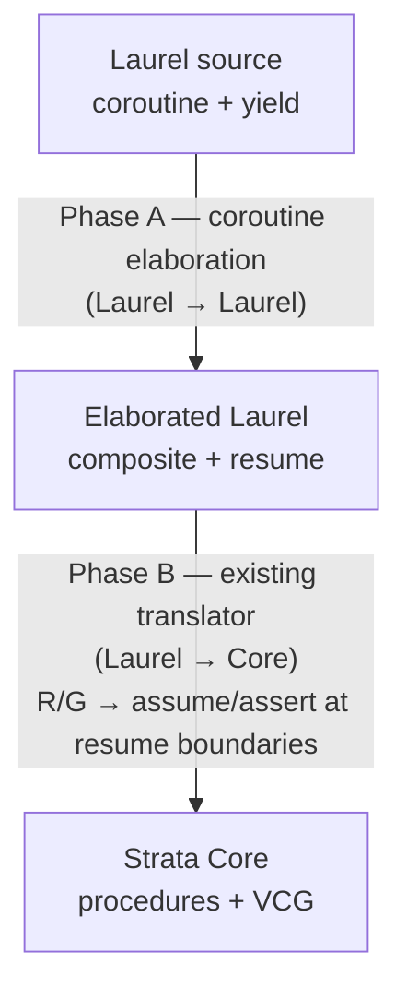

# Yield/Resume Concurrency in Strata

## Status

Design discussion. Not implemented.

This document proposes how Strata could model concurrency via coroutines with
explicit `yield` and per-coroutine **rely/guarantee** annotations over a shared
heap. The intended frontend is Laurel; the lowering target is Strata Core. No
new Core constructs are required — the feature is implementable as a Laurel
pass that desugars into existing `assert`/`havoc`/`assume` machinery.

## Programming model

A **coroutine procedure** is a Laurel procedure whose body may contain `yield`
statements. A `yield` is a **scheduling point**: at a yield, control may pass
to any other coroutine, which may modify shared state before control returns.

Yield points partition a coroutine body into a sequence of **atomic segments**:

```
seg₀   yield   seg₁   yield   seg₂   ...   return
```

Each segment runs sequentially, with no interference. Between two of *my*
segments, the rest of the world may take any number of steps over the shared
heap.

The model is intentionally minimal:

- **Cooperative.** Suspension only happens at an explicit `yield`.
- **Asymmetric.** Each coroutine yields without naming another coroutine; the
  scheduler is abstract.
- **Shared-heap.** Coroutines communicate by reading and writing a shared
  composite (typically a heap object passed in by reference).
- **No fairness.** Termination/liveness are out of scope; we verify safety only.

## Rely / Guarantee

Each coroutine declares two predicates over **two heap states**, the prior
(`old`) and current:

- `rely R(h, h')` — a relation other coroutines are permitted to establish on
  the shared state between two of *my* yields.
- `guarantee G(h, h')` — a relation *I* promise to establish on the shared state
  across each of *my* atomic segments.

`R` is required to be reflexive and transitive, so a single application
`R(h_old, h_new)` summarizes any number of foreign segments. `G` has no such
requirement, since it is checked once per segment.

### Pairwise soundness

For each ordered pair of distinct coroutines `(c, c')`, the verifier checks

```
forall h h'.  G_c(h, h')  ==>  R_{c'}(h, h')
```

i.e. every step `c` may take is permitted by `c'`'s rely. This is the only
*global* obligation; everything else is per-coroutine.

### Meaning of `old` in R/G clauses

Inside `rely` and `guarantee`, `old(e)` denotes the value of `e` at the start
of the current atomic segment, **not** at procedure entry. This matches the
intuition "what changed since I last had control." This is the only place where
`old` is reinterpreted relative to its meaning in `ensures`.

## Surface in Laurel

`coroutine` is surface sugar that elaborates into a composite plus a `resume`
procedure (see [Lowering pipeline](#lowering-pipeline)). The grammar additions
to [LaurelGrammar.st](../Strata/Languages/Laurel/Grammar/LaurelGrammar.st)
are parallel to the existing `requires`/`ensures`/`modifies` machinery:

```
category RelyClause;
op relyClause(cond: StmtExpr): RelyClause => "\n  rely " cond:0;

category GuaranteeClause;
op guaranteeClause(cond: StmtExpr): GuaranteeClause => "\n  guarantee " cond:0;

op coroutine (... same shape as procedure ...,
              relies: Seq RelyClause,
              guarantees: Seq GuaranteeClause,
              ...) : Procedure => ...;

op yield : StmtExpr => "yield";
```

A few notes:

- We deliberately use a distinct keyword `coroutine` rather than overloading
  `procedure`, since `coroutine` triggers Phase A elaboration; ordinary
  procedures retain their sequential semantics unchanged.
- `yield` is unit-valued in this design; two-way data flow (Python-style
  `gen.send(v)`) is sketched in [Schedulers as ordinary Laurel](#schedulers-as-ordinary-laurel)
  below as a small extension to the generated composite.
- Multiple `rely` and `guarantee` clauses are conjoined, mirroring how
  `requires` and `ensures` already compose.

## Verification rule

After Phase A elaboration, each coroutine appears as a composite `C` plus a
procedure `C.resume(self, heap)` carrying `rely R` / `guarantee G`. Phase B
turns those into Core `assert`/`havoc`/`assume` at the boundaries of `resume`:

| Program point | Generated check / update |
|---|---|
| Coroutine `new C(...)` | `self#H_snap := heap`; `self#pc := 0`. |
| `C.resume` entry | `assume R(self#H_snap, heap)` &nbsp;— scheduler may have run other coroutines since I last ran, but only in ways my rely permits. |
| `C.resume` exit | `assert G(self#H_snap, heap)` &nbsp;— I respected my guarantee. <br> `self#H_snap := heap` &nbsp;— record snapshot for next resume. |

This is exactly the pattern that already drives
[`CallElim`](../Strata/Transform/CallElim.lean): "call to an unknown procedure
with a summary." Calling `resume` is "call this coroutine for one segment;
between then and now, treat the heap under summary `R`."

`old(e)` inside `R`/`G` desugars to `e[heap := self#H_snap]`. Because each
`resume` call runs exactly one segment, there's no distinction between
"procedure-entry snapshot" and "segment-start snapshot."

## Lowering pipeline

Lowering happens in two phases. The first is a **Laurel-to-Laurel** pass that
makes coroutines first-class composites with an explicit `resume` procedure;
the second is the existing Laurel-to-Core translation, which sees only
ordinary procedures and composites.



### Phase A: coroutine elaboration

For each `coroutine c(p₁, …, pₖ) rely R guarantee G { body }` we generate:

1. A composite `C` with one immutable field per parameter `pᵢ`, plus
   - `var pc: int` — index of the next yield site (0 = entry, `END` = returned),
   - `var H_snap: Heap` — segment-start snapshot of the shared heap,
   - one `var` per local variable that was live across some yield (the
     suspended stack frame). Locals that never cross a yield stay locals of
     `resume`.
2. A `procedure C.resume(self : C, heap : Heap)` whose body is a `switch` on
   `self#pc` that dispatches into the segment originating at that yield site.
   Each segment is the straight-line Laurel code between two consecutive yield
   points in the original body. After running its segment, `resume` writes the
   index of the next yield into `self#pc` and returns.
3. The `rely` / `guarantee` clauses on the source `coroutine` move verbatim
   to the generated `C.resume` procedure. These are not yet
   `requires` / `ensures`: Phase B turns them into Core-level
   `assert`/`havoc`/`assume` at `resume`'s boundaries.

Pseudocode for the elaboration of `worker` from the example below:

```
// generated
composite Worker {
  L:  SpinLock;
  me: int;
  var pc:     int;
  var H_snap: SpinLock;        // snapshot
  var done:   bool;            // promoted local
};

procedure Worker.resume(self: Worker)
  requires 0 <= self#me & self#me < self#L#N
  rely      untouched(self#L, self#me)
          & mutex(self#L) & lockedIffCS(self#L)
  guarantee onlyMy(self#L, self#me)
          & mutex(self#L) & lockedIffCS(self#L)
  modifies self, self#L
{
  if (self#pc == 0) {
    self#done := false;
    self#pc := 1
  } else if (self#pc == 1) {
    if (!self#L#held) {
      self#L#held := true;
      self#L#inCS[self#me] := true;
      self#pc := 2
    } else {
      self#pc := 1                  // still spinning
    }
  } else if (self#pc == 2) {
    // ---- critical section ----
    self#pc := 3
  } else if (self#pc == 3) {
    self#L#inCS[self#me] := false;
    self#L#held := false;
    self#done := true;
    self#pc := END
  };
};
```

A user-written `resume(g, v)` call (Python `gen.send`) is rewritten to a
direct procedure call to `C.resume`.

### Phase B: lowering rely/guarantee on `resume`

Once a coroutine is a composite with a `resume` procedure, Phase B turns the
`rely`/`guarantee` annotations into ordinary Core `requires`/`ensures` plus a
`H_snap`-style scheduling-step encoding. This step is identical to what the
inline-yield design needed, just relocated to the start and end of `resume`:

```
// at entry of C.resume
//   (before running the segment dispatch)
init H_snap_cur : Heap := heap;     // segment-start snapshot
assume R(self#H_snap, heap);        // scheduler ran some other coroutines
                                    // since I last ran; rely permitted that.

... segment dispatch ...

// at exit of C.resume
assert G(H_snap_cur, heap);         // I respected my guarantee.
self#H_snap := heap;                // record for next resume
```

`R` and `G` are ordinary Core boolean expressions. `old(e)` inside R/G
desugars to `e[heap := self#H_snap]` (i.e. the snapshot held in the
coroutine instance, not a procedure-entry snapshot — `resume` is called
once per segment, so the two coincide).

The pairwise compatibility check becomes one Core procedure per ordered pair
of coroutine *types*, quantified over their parameter sets:

```
procedure compat_C_D ()
  ensures forall p : ParamsOf(C). forall p' : ParamsOf(D). p ≠ p' ==>
            forall h h'. G_C(h, h')[params := p] ==> R_D(h, h')[params := p'];
```

Heap parameterization
([HeapParameterization.lean](../Strata/Languages/Laurel/HeapParameterization.lean))
already supplies the explicit heap input/output that `resume` needs, and
call elimination ([CallElim.lean](../Strata/Transform/CallElim.lean)) handles
calls to `resume` like any other call — no new transform.

## Example: an N-process mutex

`N` workers compete for a critical section over a shared composite. We use a
test-and-set spinlock idiom rather than Peterson's algorithm — Peterson is
intrinsically two-process and would force a `requires L#N == 2`, which would
make the example say more about Peterson than about the framework. Atomic
test-and-set falls out of the model for free: a segment between two `yield`s
is atomic by construction, so a same-segment `if (!held) held := true` cannot
be raced.

```
composite SpinLock {
  N: int;                              // number of workers (immutable)
  var held: bool;
  var inCS: Map int bool;              // ghost: which workers are in CS
};

// At most one worker is in its critical section.
function mutex(L: SpinLock): bool
  ensures forall i: int =>
          forall j: int =>
            0 <= i & i < L#N & 0 <= j & j < L#N & i != j
            ==> !(L#inCS[i] & L#inCS[j]);

// Coupling: `held` is set iff some worker is in its CS.
function lockedIffCS(L: SpinLock): bool
  ensures L#held <==> exists i: int =>
                        0 <= i & i < L#N & L#inCS[i];

// "My CS-slot was not modified across the foreign segment."
function untouched(L: SpinLock, me: int): bool
  ensures old(L#inCS[me]) == L#inCS[me];

// "Only my CS-slot was modified across my segment."
function onlyMy(L: SpinLock, me: int): bool
  ensures forall j: int =>
            0 <= j & j < L#N & j != me
            ==> old(L#inCS[j]) == L#inCS[j];
```

A single parameterized coroutine handles every worker:

```
coroutine worker(L: SpinLock, me: int)
  requires 0 <= me & me < L#N
  rely      untouched(L, me) & mutex(L) & lockedIffCS(L)
  guarantee onlyMy(L, me)    & mutex(L) & lockedIffCS(L)
{
  var done: bool := false;
  while (!done)
    invariant !done ==> !L#inCS[me]
    invariant mutex(L)
    invariant lockedIffCS(L)
  {
    if (!L#held) {
      // Same segment: test-and-set is atomic.
      L#held := true;
      L#inCS[me] := true;
      yield;
      // ---- critical section ----
      yield;
      // ---- end CS ----
      L#inCS[me] := false;
      L#held := false;
      done := true
    };
    yield
  }
};
```

### What the verifier discharges

1. **Pairwise compatibility** — for `p ≠ p'`,
   `G_worker[me := p] ==> R_worker[me := p']`. The non-trivial conjunct is
   `onlyMy(L, p) ==> untouched(L, p')`: instantiating the inner quantifier in
   `onlyMy` at `j := p'` (legal because `p' ≠ p`) yields exactly
   `old(L#inCS[p']) == L#inCS[p']`. The other conjuncts (`mutex`, `lockedIffCS`)
   are 1-state predicates evaluated on the post-state and match identically.
2. **Per-segment guarantee** — at every `yield` and at `return`, only the
   `me`-indexed `inCS` slot was written, and `held` was written together with
   `inCS[me]` exactly when entering or leaving CS, preserving `lockedIffCS`.
3. **Mutex preservation** — the rely guarantees `lockedIffCS(L)` holds on
   entry to each segment, so when a worker observes `!L#held` it can conclude
   `forall j. !L#inCS[j]`; setting `inCS[me] := true` then preserves `mutex`.
4. **Loop invariant** — standard; `mutex` and `lockedIffCS` are carried by
   both rely and guarantee, so they propagate across yields automatically.

Nothing in this proof depends on `L#N`. The same coroutine, the same R/G,
and the same four obligations cover every choice of `N ≥ 1`.

### Pairwise soundness for parameterized coroutines

The compatibility check generalizes from "one VC per ordered pair of named
coroutines" to "one VC per ordered pair of *instances*." For a single
parameterized coroutine spawned with parameter set `Π`, the obligation
collapses to a single quantified VC:

```
forall p p' : Π.  p ≠ p'  ==>  forall h h'.
   G_worker(h, h')[me := p]  ==>  R_worker(h, h')[me := p']
```

`Π` need not be finite or known up front — only the parameter type matters.
For the spinlock above, `Π = int` (constrained by `0 ≤ me < L#N`) and the
quantification is over arbitrary worker identifiers. The proof obligation is
a single quantified Core formula in every case, and discharge does not depend
on `L#N`.

## Schedulers as ordinary Laurel

Because each coroutine is now a composite with a regular `resume` procedure,
schedulers are just ordinary Laurel code — they don't know they're driving
coroutines:

```
procedure schedule(workers: Set Worker)
  requires forall w: Worker => w in workers ==> w#L == sharedL
{
  while (exists w: Worker => w in workers & w#pc != END)
    invariant mutex(sharedL)
    invariant lockedIffCS(sharedL)
  {
    var pick: Worker := nondetPick(workers);
    assume pick in workers;
    resume(pick)
  }
};
```

Nothing in this loop knows how many workers there are. The verifier
discharges the loop invariant from each `resume` call's `ensures` (which
preserves `mutex` and `lockedIffCS` per the guarantee), and the pairwise
compatibility VC is the same single quantified formula regardless of
`|workers|`.

This view also unlocks two-way `yield e` / `resume(g, v)` data flow: a
coroutine composite gains `outgoing : T_yield` and `incoming : T_resume`
fields read/written at the segment boundaries inside `resume`. Because a
coroutine instance is owned by its resumer between resumes (no other
scheduler step touches it), those fields fall under ordinary sequential
reasoning — they are not shared state, and the R/G discipline does not
apply to them.

## Implementation status

Stages 1 and 1.5 are complete. Coroutines, `yield`, `resume`,
`requires`/`ensures` (interpreted per-resume / per-yield in coroutine
context), and the `yields (x: T)` / `resumes (y: U)` channel bindings
parse, resolve, and round-trip through pretty-printing. Coroutine names
register in the type namespace so `var co: producer := producer(args)`
resolves. Programs that contain a coroutine produce a single targeted
*"not yet verified (Phase A elaboration not implemented)"* diagnostic
at pipeline time rather than crashing downstream.

This section is the running status doc — what's landed, what's pending,
and where the open follow-ups sit.

### Landed

#### Grammar ([LaurelGrammar.st](../Strata/Languages/Laurel/Grammar/LaurelGrammar.st))

- New categories: `CoroutineSpec`, `YieldsClause`, `ResumesClause`.
- New ops:
  - `yield` (single nullary form). Dual-position: as a statement, drops
    the resumed value; as an expression (`z := yield`), evaluates to
    the value sent in by the next resume.
  - `returnVoid` — bare `return` (no value). Used as the iterator
    terminator inside coroutines.
  - `yieldsClause(parameters: CommaSepBy Parameter)` — `yields (x: T, ...)`.
    Mirrors `returns (...)` in shape; the grammar accepts ≥ 0
    parameters but C→A rejects empty parens.
  - `resumesClause(parameters: CommaSepBy Parameter)` — `resumes (y: U, ...)`.
  - `coroutine` (top-level Coroutine production); the spec is a single
    optional `coroutineSpec` block.
  - `coroutineCommand` (top-level Command wrapper).
- `coroutineSpec(requires: Seq RequiresClause, ensures: Seq EnsuresClause, modifies: Seq ModifiesClause)`
  reuses the existing `requires`/`ensures`/`modifies` clauses. The
  per-resume / per-yield temporal interpretation is determined by the
  enclosing coroutine's kind, not by the keyword.
- `resume(g)` / `resume(g, v)` and `old(e)` both reuse the generic
  `call` production; the C→A translator rewrites the matching call
  shapes into dedicated AST nodes.

#### AST ([Laurel.lean](../Strata/Languages/Laurel/Laurel.lean))

- New `ProcedureKind = Regular | Coroutine`.
- `Procedure` carries three new fields, all defaulted so existing
  literals compile unchanged:
  - `kind : ProcedureKind`,
  - `yields : List Parameter` — outgoing channel bindings (empty = no
    clause),
  - `resumes : List Parameter` — incoming channel bindings.
- Coroutine specs reuse the existing `preconditions : List Condition`
  field for `requires` clauses, and store `ensures` clauses in
  `Body.Opaque.postconditions` (the same place ordinary procedure
  postconditions live).
- `StmtExpr.Yield` is nullary (no payload). Suspends; in expression
  position evaluates to the resume value.
- `StmtExpr.Resume (target : AstNode StmtExpr) (value : Option (AstNode StmtExpr))`
  covers both `resume(g)` and `resume(g, v)`.
- `StmtExpr.Return (value : Option (AstNode StmtExpr))` already
  supported `none`; bare `return` source now produces it.

#### Translators

- **Concrete→Abstract** ([ConcreteToAbstractTreeTranslator.lean](../Strata/Languages/Laurel/Grammar/ConcreteToAbstractTreeTranslator.lean)):
  - `Yield` arm in `translateStmtExpr`.
  - `q\`Laurel.returnVoid` arm produces `Return none`.
  - `q\`Laurel.call` arm pattern-matches `resume(...)` (1 or 2 args)
    and `old(e)` (1 arg) and emits `Resume` / `Old` AST nodes.
  - `translateCoroutineSpec` reuses the existing
    `translateRequiresClauses` / `translateEnsuresClauses` /
    `translateModifiesClauses` helpers — no separate rely/guarantee
    parsers.
  - `parseChannelClause` parses optional `yields (...)` / `resumes (...)`
    clauses; rejects empty parens with *"requires at least one
    parameter; omit the clause if there is no value"*.
  - `parseCoroutine` builds a `Procedure` with `kind := .Coroutine`,
    the `yields` / `resumes` bindings, `preconditions` from the spec's
    requires, and an `Opaque` body whose `postconditions` come from the
    spec's ensures and `modifies` comes from the spec's modifies.
  - `q\`Laurel.coroutineCommand` arm in `parseTopLevel`, surfacing
    coroutines as members of `Program.staticProcedures`.
- **Abstract→Concrete** ([AbstractToConcreteTreeTranslator.lean](../Strata/Languages/Laurel/Grammar/AbstractToConcreteTreeTranslator.lean)):
  - `Yield`, `Resume`, and `Old` arms emit the corresponding grammar
    ops; `Resume` and `Old` reuse the generic `call` op.
  - `coroutineToOp` / `coroutineCommandOp` printers; a kind dispatcher
    `procOrCoroutineCommandOp` so `programToStrata` emits the right
    top-level command per procedure.
  - `coroutineSpec` is omitted when preconditions, postconditions, and
    modifies are all empty, so unannotated coroutines pretty-print
    cleanly.
  - `yields`/`resumes` clauses are omitted when their lists are empty.
  - `Return none` continues to emit `return { }` (load-bearing for
    `EliminateValueReturns`'s output; source-written `returnVoid`
    does not symmetrize the round-trip).

#### Resolution ([Resolution.lean](../Strata/Languages/Laurel/Resolution.lean))

- `resolveProcedure` and `resolveInstanceProcedure` propagate `kind`,
  `yields`, `resumes` (the requires/ensures/modifies plumbing is the
  same as for ordinary procedures).
- The bound names from `yields`/`resumes` are in scope inside the body
  and inside `requires`/`ensures` clauses. Stage 1.5 does not enforce
  scope-restriction (e.g. rejecting `y` outside `requires`); misuse
  surfaces as a standard unbound-name diagnostic.
- `resolveStmtExpr` handles `Yield` and `Resume` (recursing into
  subexpressions).
- **`return e` rejected inside coroutines** with a clear diagnostic
  pointing the user to `x := e; yield`.
- **Coroutine names registered as `.coroutineType`** in the type
  namespace, alongside composites/datatypes/etc. `var co: producer`
  resolves; `var co: producer := producer(args)` parses and resolves.
  Coroutines are *not* registered as `.staticProcedure` — semantically
  they are types, not callables. The constructor and `resume` form a
  pair that Phase A elaboration will materialize.

#### Type inference ([LaurelTypes.lean](../Strata/Languages/Laurel/LaurelTypes.lean))

`Yield _` and `Resume _ _` are tagged `HighType.Unknown`. The honest
types are `T_resume` (of the enclosing coroutine, from the `resumes`
binding) and `T_yield` (of the target's coroutine type, from its
`yields` binding) respectively, but computing them requires
enclosing-procedure context that the current pure walk does not have.
Real inference is deferred to Stage 2, when elaboration replaces these
nodes with composite-field reads whose types are statically known.
Using `Unknown` rather than `TVoid` avoids silently accepting bad
assignments like `int_var := yield`.

#### Downstream stubs

- [`MapStmtExpr.lean`](../Strata/Languages/Laurel/MapStmtExpr.lean)
  recurses through `Yield` (no-op rebuild) and `Resume` (recursing into
  target and optional value).
- [`FilterPrelude.lean`](../Strata/Languages/Laurel/FilterPrelude.lean)
  collects names from `Resume` subexpressions; `Yield` is name-free.
- [`LaurelToCoreTranslator.lean`](../Strata/Languages/Laurel/LaurelToCoreTranslator.lean)
  raises *"Stage 2 not implemented"* on `Yield` and `Resume` in both
  expression and statement positions. This is unreachable in practice
  because `rejectCoroutines` short-circuits earlier in the pipeline.

#### Pipeline stub ([LaurelCompilationPipeline.lean](../Strata/Languages/Laurel/LaurelCompilationPipeline.lean))

The `rejectCoroutines` pass is the first entry in `laurelPipeline`. It
scans for `kind = .Coroutine` and emits one targeted diagnostic per
coroutine. The program flows through unchanged, so the rest of the
pipeline doesn't trip — the user sees a single message instead of a
per-yield-point cascade from the Laurel→Core translator. This pass
deletes itself in Stage 2 once Phase A elaboration removes coroutines
before this point.

#### Tests ([T23_Coroutines.lean](../StrataTest/Languages/Laurel/Examples/Fundamentals/T23_Coroutines.lean))

Eleven focused tests, all using `processResolution` (parse + resolution)
unless noted; the harness fires `#guard_msgs (drop info, error)` so
parse failures and unexpected diagnostics break the build.

| Test | What it covers |
|---|---|
| `EmptyCoroutine` | bare `coroutine empty() { };` reaches the AST and resolves cleanly |
| `CounterCoroutine` | `yield` (no value) inside a `while` body |
| `YieldValue` | `yields (x: T)` binding + `x := e; yield` per-site assignment |
| `AbstractCoroutine` | full `coroutineSpec` (`requires`, `ensures` with `old(...)`, `modifies`) on a bodyless coroutine |
| `SpawnAndResumeStmt` | `var co: producer := producer(args)` + `resume(co)` (drops result) |
| `ResumeBindsResult` | `z := resume(co)` in expression position |
| `ResumeWithSend` | two-arg `resume(co, v)` |
| `CoroutineConsumesResumed` | coroutine consumes the resumed value via `z := yield` |
| `ReturnWithValueInCoroutine` | negative test: `return e` in a coroutine resolves to the diagnostic |
| `BareReturnInCoroutine` | `return` (no value) as early termination from a nested loop/branch |
| `CoroutineRejected` | full pipeline (uses `processLaurelFile`); pins the `rejectCoroutines` diagnostic |

### Remaining TODOs

Items deliberately deferred from Stage 1 / 1.5; each has a known design
direction. None of these block Stage 2 from starting.

#### Diagnostics and surface restrictions

- **Restrict bare `return` to coroutines.** Today resolution permits
  `Return none` everywhere it parses. The intent is for ordinary
  procedures to terminate by falloff (or `return e` for the
  single-output case); bare `return` in a non-coroutine should be a
  resolution error. Deferred so we can audit
  [`EliminateValueReturns`](../Strata/Languages/Laurel/EliminateValueReturns.lean)
  interactions before tightening.
- **Reject unsafe `exit <label>` in coroutines.** A labelled-block exit
  whose target spans a `yield` is unimplementable after Phase A's
  segment shredding. Phase A should reject these at elaboration time
  with *"`exit done` cannot leave a labelled block that contains
  `yield`."* Same-segment exits are safe and stay legal.
- **Scope-restriction errors for `x` and `y`.** Stage 1.5 puts the
  channel bindings in scope but does *not* enforce that `x` only
  appears in per-yield `ensures` and `y` only in per-resume `requires`.
  Misuse currently produces an unbound-name diagnostic via standard
  resolution, which is acceptable but less specific than a dedicated
  message.
- **Design-rationale sections still use `relies`/`guarantees`
  terminology.** The "Stage 1.5 — Value-flow contracts" and
  "Implementation plan" sections of this doc were written before the
  reviewer-driven rename to `requires`/`ensures`. The semantics they
  describe are unchanged; the surface is `requires`/`ensures` plus a
  `kind`-determined per-resume / per-yield interpretation. A future
  cleanup pass should update the prose to match.

#### Type checking

- **Argument-arity and argument-type checks at coroutine spawn sites
  (`producer(arg1, arg2)`).** Today resolution permits arbitrary
  argument shapes when the callee resolves to `.coroutineType`. Phase
  A's elaboration into `new Producer(...)` will pick this up via the
  existing composite-constructor type checker; the check therefore
  lands in Stage 2 for free.
- **Type-check `resume(co)` and `resume(co, v)`.** Specifically:
  `co`'s static type must be a coroutine type, and `v`'s type must
  match that coroutine's `resumes` binding. Same disposition as
  above — falls out of Stage 2 elaboration into composite-method
  calls.
- **Plumb `T_resume` and `T_yield` into `LaurelTypes`** so that
  `Yield` and `Resume` return real types instead of `Unknown`. Same
  Stage 2 footing.

#### Pretty-print round-trip

- **Asymmetric `Return none` round-trip.** Source-side `return` parses
  to `Return none`, but the A→C printer emits `return { }` for
  `Return none` (load-bearing for `EliminateValueReturns`'s output).
  Re-parsing then yields `Return (some <empty block>)`. Fine for
  current usage; revisit if anything starts depending on round-trip
  identity.

#### Stage 2 work proper (Phase A elaboration)

- **Liveness analysis** of locals across `yield` boundaries. Locals
  live across a yield are promoted to fields of the generated
  composite; the rest stay locals of `resume`.
- **Yield-CFG construction**: number yield sites, partition the body
  into segments, emit a `switch (self#pc)` body for `resume`. Each
  segment ends by writing `self#pc := next` and exiting `resume`;
  bare `return` writes `self#pc := END`.
- **Composite generation**: emit `composite C { params; var pc; var
  H_snap; promotedLocals; outgoing; incoming }` and a `procedure
  C.resume(self : C)` whose `rely` / `guarantee` are copied verbatim
  from the source `coroutine`, with `x` and `y` rewritten to the
  generated outgoing/incoming fields.
- **Constructor elaboration**: `producer(args)` becomes `new Producer(
  args)` plus an init block setting `pc := 0`, `H_snap := heap`, and
  the input parameters.
- **Call-site rewrite**: `resume(co)` becomes `Producer.resume(co)`;
  `resume(co, v)` additionally writes `co#incoming := v` before the
  call.
- **Per-site value lowering**: `yield` in expression position becomes
  a read of `self#incoming`; `x := e; yield` writes `self#outgoing`
  before the suspension.
- **Pipeline placement**: register Phase A *before*
  `HeapParameterization`, so the elaborated `resume` picks up heap
  parameters by the existing pass.
- **Delete `rejectCoroutines`** once Phase A is in (no coroutines
  remain by the time the pass would have run).

#### Stage 3 work proper (Core lowering and VCG)

- **Translation rule** in [`LaurelToCoreTranslator.lean`](../Strata/Languages/Laurel/LaurelToCoreTranslator.lean):
  for any procedure carrying `rely R` / `guarantee G`, emit
  `assume R(self#H_snap, heap)` at entry and
  `assert G(H_snap_cur, heap); self#H_snap := heap` at exit.
- **Pairwise compatibility VCs**: one Core procedure per ordered pair
  of coroutine *types* with the quantified `forall p p'. p ≠ p' ==>
  G_C(...) ==> R_D(...)` formula.
- **`old(e)` in `R`/`G`** desugars to `e[heap := self#H_snap]`.

## Stage 1 reflection

Stage 1 surfaces four gaps that need to close before Stage 2 elaboration
can produce a verifiable program:

1. **The yielded value has no spec name.** `guarantees` cannot mention
   the value `e` flowing out of `yield e`.
2. **The resumed value has no surface or spec name.** `resume(co, v)`
   parses but `v` is invisible to the coroutine's contract.
3. **There is no contract surface for resume preconditions.** A coroutine
   that requires its resumer to send `v >= 0` cannot say so.
4. **`yield` is overloaded with two roles.** Both
   "suspend-and-resume-with-value" and "yield-this-value-out" share one
   surface, conflating per-yield-site obligation checks with input flow.

Stage 1.5 closes these gaps with a small, surface-only design — no
elaboration logic moves. Stage 2 is unblocked once Stage 1.5 is in.

## Stage 1.5 — Value-flow contracts

Goal: give the value channels (yield outward, resume inward) the same
contract surface the heap channels already have, by extending `relies`
and `guarantees` rather than introducing new clause keywords.

### Surface additions

Two new clauses on the coroutine declaration, each binding a name and a
type:

```
coroutine echo() yields x: int resumes y: int
  requires <heap + spawn-arg predicates>     // one-shot, at spawn
  relies   <heap + y predicates>              // per-resume, at re-entry
  guarantees <heap + x predicates>            // per-yield, at suspension
{ ... }
```

- `yields x: T` declares `x` as the **outgoing channel** binding. `x` is
  in scope inside the body (where the user writes to it) and inside
  `guarantees` (where the verifier reads it).
- `resumes y: U` declares `y` as the **incoming channel** binding. `y` is
  in scope **only inside `relies`** — it names "the value the resumer
  will send on the next resume." The body retrieves it via the expression
  form of `yield` (see below), giving it a local name.
- Both clauses are optional. Defaults: `yields x: unit`, `resumes y: unit`.
- The existing `: T` after the parameter list (the Stage 1 yieldType
  slot) is **replaced** by `yields x: T`. Not deprecated — overwritten.
  Stage 1 was prototyping; we have no users to break.

### Surface for `yield` and `resume`

`yield` and `resume` keep their distinct AST nodes from Stage 1. Two
deliberate simplifications:

- **`yield e` is dropped.** The `yieldValue` grammar op and the `value`
  payload on `StmtExpr.Yield` are removed. Yielding a value is now
  spelled `x := e; yield`, mirroring how procedures spell return-with-
  value as `r := e; return`. One canonical form per concept.
- **`return e` is rejected inside coroutines.** Resolves to a clear
  error: *"return with a value is not allowed in a coroutine; use
  `x := e; yield` to yield, or bare `return` to terminate."*
- **Bare `return` is the coroutine iterator-termination form.** Phase A
  elaboration compiles it to `pc := END; <exit current segment>`,
  regardless of nesting depth — no CFG-spanning analysis needed because
  the effect is the same wherever `return` appears. The motivating use
  case is early termination from inside a loop or conditional branch,
  which falloff cannot express cleanly.
  Stage 1.5 surface: the grammar admits bare `return` as an op
  (`returnVoid`); resolution permits it everywhere it parses without
  emitting a kind-mismatch diagnostic. **A future tightening should
  reject bare `return` in non-coroutine procedures**, since procedures
  are expected to terminate by falloff (or `return e` for the
  single-output case); the diagnostic is intentionally deferred so we
  don't preempt design space for non-coroutine early-exit before we've
  audited what existing passes (notably `EliminateValueReturns`) need.

`yield` is **dual-position**:
- *Statement* `yield;` — suspends, drops the resumed value.
- *Expression* `z := yield` — suspends, binds the resumed value to `z`.

This is the only way the body sees the resume-side value; `y` itself is
spec-only.

### Verification rule

Per-yield obligation when the body reaches `yield`:

1. `assert G(H_snap, h, x)` — guarantee holds on the heap and on the
   current value of the outgoing binding `x`.
2. `havoc h`; havoc a fresh `v : U` representing the next resumed value.
3. `assume R(H_snap, h, v)` — rely holds, with `y` substituted by `v`.
4. The expression-position result of `yield` is `v`. `H_snap := h`.

Per-resume call obligation at the call site `resume(co, v)`:

5. `assert <single-state part of R on y>[y := v]` — caller discharges
   the value-precondition. (The heap part of R is established by the
   caller's own pipeline reasoning, not by an explicit assert here.)

`old(x)` and `old(y)` are rejected: the channel bindings are
single-state, with no history.

### Hazard: `exit <label>` and segment shredding

Phase A elaboration shreds a coroutine body at every `yield` into
independent segments dispatched by a `pc` switch. Lexical control-flow
constructs whose targets cross a yield therefore lose their meaning
post-elaboration. Concretely:

- **Bare `return` inside a coroutine** is safe regardless of nesting:
  the effect is "set `pc := END` and exit the current segment," and
  Phase A handles this uniformly. No analysis required.
- **`exit <label>` whose labelled block contains a `yield`** is *not*
  safe: after segment shredding, the target landing pad sits in a
  different segment than the `exit`, and the lexical block scope is
  gone. Phase A must reject these at elaboration time with a precise
  diagnostic — *"`exit done` cannot leave a labelled block that
  contains `yield`"* — implemented as a one-pass CFG check per
  `exit` site against its target block's contained yields.
- **`exit <label>` confined to a single segment** (the labelled block
  has no `yield` inside it) is safe and compiles to ordinary
  intra-segment control flow.

This restriction surfaces in Stage 2 when Phase A runs the analysis.
Stage 1.5 does not need to enforce it — programs that violate the rule
are still rejected by the `rejectCoroutines` pipeline pass on different
grounds (no Phase A elaboration yet).

### Why R/G subsumes preconditions on resume

Relies and preconditions are conceptually the same — both are obligations
the caller discharges before passing control to the coroutine. The only
distinction is *when*:

- `requires` holds at *spawn* (entry, with the constructor's args).
- `relies` holds at *every yield boundary* (re-entry, with the heap
  state and the resume value).

Since `relies` already binds `y`, no new clause is needed for "what the
resumer must guarantee about `v`." It falls out of the existing rule.

### Worked example

```
coroutine echo() yields x: int resumes y: int
  relies y >= 0
  guarantees x >= y     // I always yield at least what was last sent
{
  var z: int := 0;
  while (true)
    invariant z >= 0
  {
    z := yield;          // suspends with current x; receives next v
    // here z >= 0 holds, by the rely on y substituted at this site
    x := z + 1;
    yield                // suspends with new x; resumed value dropped
  }
};
```

Resumer side:
```
var co := echo();
resume(co, 3);           // verifier checks 3 >= 0 (rely on y)
                         //   x is now 4 (assuming the example above)
var k: int := resume(co, 7);
                         // verifier checks 7 >= 0 (rely on y)
                         // k = 8
```

### Out of scope for Stage 1.5

- **Type-level checking that `x`/`y` are used in the right scopes.**
  Stage 1.5 wires up the bindings; surface checks for "did the user put
  `y` in a guarantee?" come with resolution work in Stage 2.
- **The terminal-value channel.** `return e` is rejected; coroutines
  produce no separate return value. If a future need arises, it can be
  added without disturbing the Stage 1.5 design.

## Implementation plan

A staged plan that aligns with the natural test surface at each step. Every
stage produces a runnable, testable artifact before the next one starts.

### Stage 1 — Syntax support

Goal: parse `coroutine`, `rely`, `guarantee`, `yield`, `resume(g)` into the
existing Laurel AST without changing semantics. Verification is a no-op stub.

- **Grammar** ([LaurelGrammar.st](../Strata/Languages/Laurel/Grammar/LaurelGrammar.st)):
  add `RelyClause`, `GuaranteeClause`, `coroutine` (parallel to `procedure`),
  `yield` (a `StmtExpr`), `resume(g)` (a `StmtExpr`).
- **AST** ([Laurel.lean](../Strata/Languages/Laurel/Laurel.lean)):
  - extend `Procedure` with `relies : List Condition` and
    `guarantees : List Condition` (mirroring `preconditions`), and a
    `kind : ProcedureKind` flag distinguishing `Procedure` from `Coroutine`;
  - extend `StmtExpr` with `Yield` and `Resume (target : AstNode StmtExpr)`.
- **Concrete↔abstract translators**
  ([Grammar/AbstractToConcreteTreeTranslator.lean](../Strata/Languages/Laurel/Grammar/AbstractToConcreteTreeTranslator.lean),
   [Grammar/ConcreteToAbstractTreeTranslator.lean](../Strata/Languages/Laurel/Grammar/ConcreteToAbstractTreeTranslator.lean)):
  thread the new constructors through.
- **Resolution** ([Resolution.lean](../Strata/Languages/Laurel/Resolution.lean)):
  `rely`/`guarantee` bodies resolve against the same scope as `ensures`
  (parameters + heap + `old`); `Yield` and `Resume` are resolved like other
  StmtExprs.
- **Pipeline placement**: register a no-op pass right after `Resolution` so
  `lake test` smokes the new syntax; verification stage emits a "coroutine
  feature not yet enabled" diagnostic if it sees one.
- **Tests**: a handful of `.laurel.st` files under [`Examples/`](../Examples)
  that parse and pretty-print round-trip, and one negative test (e.g. `yield`
  in a non-coroutine procedure → diagnostic).

**Exit criterion**: existing tests stay green; new parse/print round-trip
tests pass; programs containing `coroutine`/`yield` parse but produce a clear
"unsupported" diagnostic at verification time.

### Stage 2 — Laurel→Laurel transformation

Goal: implement Phase A from the [Lowering pipeline](#lowering-pipeline). A
`coroutine` declaration is rewritten into an ordinary `composite` plus an
ordinary `procedure C.resume` carrying `rely`/`guarantee` annotations.

Question to answer:
- What does a `YieldElim` mean in principle

- **New file** `Strata/Languages/Laurel/CoroutineElaboration.lean`:
  - **Liveness analysis** of locals across yield points. Variables live across
    a yield are promoted to fields of `C`; variables that aren't stay locals
    of `resume`.
  - **Yield-CFG construction**: number the yield points `0, 1, …`; partition
    the body into segments; emit a `switch (self#pc)` body for `resume`.
    Tail-position semantics: each segment ends by writing `self#pc := next`
    and exiting `resume`. `return` writes `self#pc := END`.
  - **Composite generation**: emit `composite C { params; var pc; var H_snap;
    promotedLocals }` and a `procedure C.resume(self : C)` whose `rely` /
    `guarantee` are copied verbatim from the source `coroutine`.
  - **Call-site rewrite**: `resume(g)` becomes `C.resume(g)` for `g : C`.
- **Pipeline placement**: as a `LaurelPass` registered in
  [LaurelCompilationPipeline.lean](../Strata/Languages/Laurel/LaurelCompilationPipeline.lean)
  *before* `HeapParameterization`, so the elaborated `resume` picks up heap
  parameters by the existing pass and is then handled identically to any
  other procedure. (Order is load-bearing: heap parameterization, modifies
  clauses, etc. all need to see plain procedures.)
- **`new C(...)` constructor**: at every site that creates a coroutine
  instance, also emit `g#H_snap := heap; g#pc := 0`.
- **Tests** under [`StrataTest/Languages/Laurel/`](../StrataTest/Languages/Laurel):
  golden-file tests of "coroutine in → composite + resume out" for several
  shapes (no yields, one yield, yield-in-loop, yield-in-conditional,
  yield-in-conditional-branch).

**Exit criterion**: after Stage 2, the elaborated program has no
`coroutine`/`yield`/`resume` constructs left, only ordinary composites and
procedures with `rely`/`guarantee` annotations. The existing pipeline (heap
parameterization, modifies, …) accepts the elaborated program unchanged.

### Stage 3 — Core lowering and VCG

Goal: implement Phase B. `rely`/`guarantee` on a `procedure` become
`assume`/`assert` against an `H_snap` snapshot, and the pairwise
compatibility check is emitted.

- **Carry rely/guarantee into Core**: extend `Core.Procedure.Spec`
  ([Procedure.lean](../Strata/Languages/Core/Procedure.lean)) with `relies`
  and `guarantees` fields, or — if we'd rather keep Core unchanged — desugar
  them into Core-level `requires`/`ensures` plus locals during translation.
  Recommended: desugar at translation time, do not extend Core.
- **Translation rule** in
  [LaurelToCoreTranslator.lean](../Strata/Languages/Laurel/LaurelToCoreTranslator.lean):
  for any procedure carrying `rely R` / `guarantee G`, emit at the start of
  the body
  ```
  init H_snap_cur : Heap := heap;
  assume R(self#H_snap, heap);
  ```
  and at the end
  ```
  assert G(H_snap_cur, heap);
  self#H_snap := heap;
  ```
  with `old(e)` in `R`/`G` substituted to `e[heap := self#H_snap]`.
- **Pairwise compatibility VCs**: for each pair of coroutine *types* `(C, D)`
  in the program (including the diagonal `C = D` for parameterized
  coroutines), emit one Core procedure
  ```
  procedure compat_C_D ()
    ensures forall p : ParamsOf(C). forall p' : ParamsOf(D). p ≠ p' ==>
              forall h h'. G_C(h, h')[params := p] ==> R_D(h, h')[params := p'];
  ```
  These flow through the existing VCG and SMT backends without changes.
- **Pipeline placement**: this lives entirely in the existing
  Laurel→Core translator; no new Core dialect, no new Core transform.
- **Tests** under [`StrataTest/Languages/Laurel/`](../StrataTest/Languages/Laurel)
  and [`StrataTest/Transform/`](../StrataTest/Transform): the N-process
  spinlock from this doc, expected to verify; a deliberately unsound
  guarantee-vs-rely mismatch, expected to fail with a localized diagnostic;
  a per-segment guarantee violation, expected to fail at the right line.

**Exit criterion**: the spinlock example in this document verifies via
`lake exe strata verify`. A buggy variant (e.g. dropping the `if (!L#held)`
guard) reports a precise mutex-violation counterexample.

### Cross-cutting concerns

- **Diagnostics provenance**: every generated `assert`/`assume` should carry
  metadata pointing back to the source `yield` / `coroutine` location, so
  failed obligations land on the user's code rather than on synthesized
  composite fields. The existing
  [MetaData](../Strata/DL/Imperative/MetaData.lean) plumbing covers this.
- **`old` semantics**: rejected at parse time outside `rely`/`guarantee`/
  `ensures` contexts; in `rely`/`guarantee` it means "segment start," which
  per the [Verification rule](#verification-rule) section coincides with
  procedure entry of `resume`.
- **Documentation**: the Verso docs at
  [docs/verso/LaurelDoc.lean](verso/LaurelDoc.lean) gain a "Coroutines"
  section once Stage 2 is in.


### Future planning
- **Yield-from**: `yield from` e.g., a "recursive" call

- **True preemption / shared-memory threads.** A weaker model (no `yield`,
  every program point a scheduling point) needs more elaborate proof rules
  (Owicki-Gries, full rely/guarantee). The cooperative discipline here is a
  strict subset.
- **Fairness and liveness.** We verify safety only. Termination of a
  coroutine is the existing per-procedure `decreases` check; lockout-freedom
  is not addressed.
- **Mixed-type dynamic pools.** Parameterized coroutines (per
  [Schedulers as ordinary Laurel](#schedulers-as-ordinary-laurel)) cover
  statically *typed* but dynamically *populated* worker pools: one quantified
  VC discharges compatibility for any number of instances of the same type.
  Out of scope is mixing *different* coroutine types whose membership changes
  at runtime, where the set of ordered pairs to check itself depends on
  program state.
- **Stratified rely/guarantee** (nested coroutines with their own R/G over
  sub-state) and **ownership transfer** between coroutines are possible
  extensions but not addressed here.
